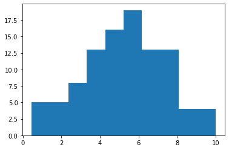
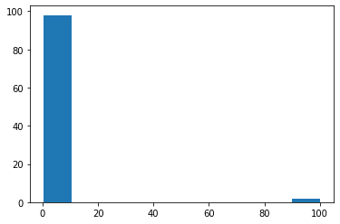
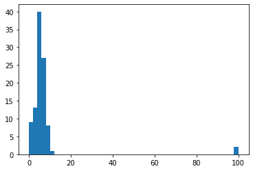
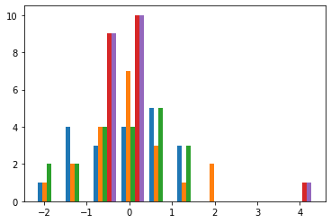
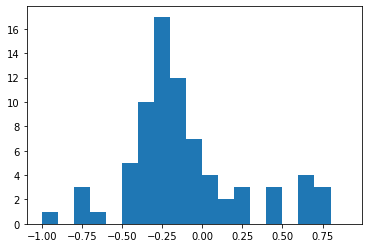
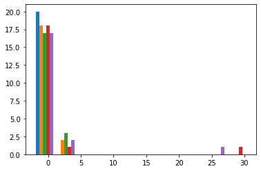
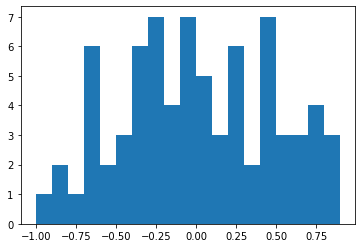

```python
import pandas as pd
import numpy as np
```


```python
df=pd.DataFrame(np.random.randn(5,3),
               columns=["c1","c2","c3"])
df
df.ix[0,0]=np.nan   # (0,0) 자리에 nan을 넣음 
df
```

    C:\Users\student\Anaconda3\lib\site-packages\ipykernel_launcher.py:4: FutureWarning: 
    .ix is deprecated. Please use
    .loc for label based indexing or
    .iloc for positional indexing
    
    See the documentation here:
    http://pandas.pydata.org/pandas-docs/stable/user_guide/indexing.html#ix-indexer-is-deprecated
      after removing the cwd from sys.path.
    


<div>
<style scoped>
    .dataframe tbody tr th:only-of-type {
        vertical-align: middle;
    }

    .dataframe tbody tr th {
        vertical-align: top;
    }

    .dataframe thead th {
        text-align: right;
    }
</style>
<table border="1" class="dataframe">
  <thead>
    <tr style="text-align: right;">
      <th></th>
      <th>c1</th>
      <th>c2</th>
      <th>c3</th>
    </tr>
  </thead>
  <tbody>
    <tr>
      <td>0</td>
      <td>NaN</td>
      <td>-0.354522</td>
      <td>1.373489</td>
    </tr>
    <tr>
      <td>1</td>
      <td>1.225421</td>
      <td>1.465659</td>
      <td>0.502776</td>
    </tr>
    <tr>
      <td>2</td>
      <td>0.391385</td>
      <td>-0.275959</td>
      <td>1.721735</td>
    </tr>
    <tr>
      <td>3</td>
      <td>0.150479</td>
      <td>-0.212460</td>
      <td>0.026216</td>
    </tr>
    <tr>
      <td>4</td>
      <td>0.642958</td>
      <td>0.712888</td>
      <td>-0.081726</td>
    </tr>
  </tbody>
</table>
</div>


```python
df.ix[1,['c1','c2','c3']]=np.nan   #1번 index의 c1,c2,c3 를 바꿈
df
```

    C:\Users\student\Anaconda3\lib\site-packages\ipykernel_launcher.py:1: FutureWarning: 
    .ix is deprecated. Please use
    .loc for label based indexing or
    .iloc for positional indexing
    
    See the documentation here:
    http://pandas.pydata.org/pandas-docs/stable/user_guide/indexing.html#ix-indexer-is-deprecated
      """Entry point for launching an IPython kernel.
    


<div>
<style scoped>
    .dataframe tbody tr th:only-of-type {
        vertical-align: middle;
    }

    .dataframe tbody tr th {
        vertical-align: top;
    }

    .dataframe thead th {
        text-align: right;
    }
</style>
<table border="1" class="dataframe">
  <thead>
    <tr style="text-align: right;">
      <th></th>
      <th>c1</th>
      <th>c2</th>
      <th>c3</th>
    </tr>
  </thead>
  <tbody>
    <tr>
      <td>0</td>
      <td>NaN</td>
      <td>-0.354522</td>
      <td>1.373489</td>
    </tr>
    <tr>
      <td>1</td>
      <td>NaN</td>
      <td>NaN</td>
      <td>NaN</td>
    </tr>
    <tr>
      <td>2</td>
      <td>0.391385</td>
      <td>-0.275959</td>
      <td>1.721735</td>
    </tr>
    <tr>
      <td>3</td>
      <td>0.150479</td>
      <td>-0.212460</td>
      <td>0.026216</td>
    </tr>
    <tr>
      <td>4</td>
      <td>0.642958</td>
      <td>0.712888</td>
      <td>-0.081726</td>
    </tr>
  </tbody>
</table>
</div>


```python
import warnings
warnings.filterwarnings(action='ignore')
```


```python
df.ix[1,['c1','c3']]=np.nan
df
df.ix[2,['c2']]=None
df.ix[3,['c2']]=None
df.ix[4,['c3']]=None
df
```


<div>
<style scoped>
    .dataframe tbody tr th:only-of-type {
        vertical-align: middle;
    }

    .dataframe tbody tr th {
        vertical-align: top;
    }

    .dataframe thead th {
        text-align: right;
    }
</style>
<table border="1" class="dataframe">
  <thead>
    <tr style="text-align: right;">
      <th></th>
      <th>c1</th>
      <th>c2</th>
      <th>c3</th>
    </tr>
  </thead>
  <tbody>
    <tr>
      <td>0</td>
      <td>NaN</td>
      <td>-0.354522</td>
      <td>1.373489</td>
    </tr>
    <tr>
      <td>1</td>
      <td>NaN</td>
      <td>NaN</td>
      <td>NaN</td>
    </tr>
    <tr>
      <td>2</td>
      <td>0.391385</td>
      <td>NaN</td>
      <td>1.721735</td>
    </tr>
    <tr>
      <td>3</td>
      <td>0.150479</td>
      <td>NaN</td>
      <td>0.026216</td>
    </tr>
    <tr>
      <td>4</td>
      <td>0.642958</td>
      <td>0.712888</td>
      <td>NaN</td>
    </tr>
  </tbody>
</table>
</div>


```python
df.fillna(0)

```


<div>
<style scoped>
    .dataframe tbody tr th:only-of-type {
        vertical-align: middle;
    }

    .dataframe tbody tr th {
        vertical-align: top;
    }

    .dataframe thead th {
        text-align: right;
    }
</style>
<table border="1" class="dataframe">
  <thead>
    <tr style="text-align: right;">
      <th></th>
      <th>c1</th>
      <th>c2</th>
      <th>c3</th>
    </tr>
  </thead>
  <tbody>
    <tr>
      <td>0</td>
      <td>0.000000</td>
      <td>-0.354522</td>
      <td>1.373489</td>
    </tr>
    <tr>
      <td>1</td>
      <td>0.000000</td>
      <td>0.000000</td>
      <td>0.000000</td>
    </tr>
    <tr>
      <td>2</td>
      <td>0.391385</td>
      <td>0.000000</td>
      <td>1.721735</td>
    </tr>
    <tr>
      <td>3</td>
      <td>0.150479</td>
      <td>0.000000</td>
      <td>0.026216</td>
    </tr>
    <tr>
      <td>4</td>
      <td>0.642958</td>
      <td>0.712888</td>
      <td>0.000000</td>
    </tr>
  </tbody>
</table>
</div>


```python
#평균값으로 대체하기
fill_mean_func=lambfa g:g.fillna(df.mean())
df.groupby(df).apply(fill_mean_func)           # 함수를 따로 지정해서 df에 지정하기 
```


      File "<ipython-input-20-ce54d8674818>", line 2
        fill_mean_func=lambfa g:g.fillna(df.mean())
                              ^
    SyntaxError: invalid syntax
    


```python
df.fillna(df.mean()) 
```


<div>
<style scoped>
    .dataframe tbody tr th:only-of-type {
        vertical-align: middle;
    }

    .dataframe tbody tr th {
        vertical-align: top;
    }

    .dataframe thead th {
        text-align: right;
    }
</style>
<table border="1" class="dataframe">
  <thead>
    <tr style="text-align: right;">
      <th></th>
      <th>c1</th>
      <th>c2</th>
      <th>c3</th>
    </tr>
  </thead>
  <tbody>
    <tr>
      <td>0</td>
      <td>0.394941</td>
      <td>-0.354522</td>
      <td>1.373489</td>
    </tr>
    <tr>
      <td>1</td>
      <td>0.394941</td>
      <td>0.179183</td>
      <td>1.040480</td>
    </tr>
    <tr>
      <td>2</td>
      <td>0.391385</td>
      <td>0.179183</td>
      <td>1.721735</td>
    </tr>
    <tr>
      <td>3</td>
      <td>0.150479</td>
      <td>0.179183</td>
      <td>0.026216</td>
    </tr>
    <tr>
      <td>4</td>
      <td>0.642958</td>
      <td>0.712888</td>
      <td>1.040480</td>
    </tr>
  </tbody>
</table>
</div>


```python
df.where(pd.notnull(df),df.mean(),axis="columns")
```


<div>
<style scoped>
    .dataframe tbody tr th:only-of-type {
        vertical-align: middle;
    }

    .dataframe tbody tr th {
        vertical-align: top;
    }

    .dataframe thead th {
        text-align: right;
    }
</style>
<table border="1" class="dataframe">
  <thead>
    <tr style="text-align: right;">
      <th></th>
      <th>c1</th>
      <th>c2</th>
      <th>c3</th>
    </tr>
  </thead>
  <tbody>
    <tr>
      <td>0</td>
      <td>0.394941</td>
      <td>-0.354522</td>
      <td>1.373489</td>
    </tr>
    <tr>
      <td>1</td>
      <td>0.394941</td>
      <td>0.179183</td>
      <td>1.040480</td>
    </tr>
    <tr>
      <td>2</td>
      <td>0.391385</td>
      <td>0.179183</td>
      <td>1.721735</td>
    </tr>
    <tr>
      <td>3</td>
      <td>0.150479</td>
      <td>0.179183</td>
      <td>0.026216</td>
    </tr>
    <tr>
      <td>4</td>
      <td>0.642958</td>
      <td>0.712888</td>
      <td>1.040480</td>
    </tr>
  </tbody>
</table>
</div>


```python
arr=np.array([1,2,3,10,20,30,0.1,0.2])
arr.min()
np.min(arr)
```


    0.1


```python
np.argmin(arr)       # 최소값의 위치
np.max(arr)          # 최댓값
np.argmax(arr)       # 최댓값의 위치
np.where(arr<1)      # where + 조건문: index 조건에맞는
```


    (array([6, 7], dtype=int64),)


```python
np.where(arr>=10)
```


    (array([3, 4, 5], dtype=int64),)


```python
np.where(arr>=10,0,arr) # np.where(조건,참,거짓): 조건이 참일때는 0 거짓일 때는 arr을 그대로 둬라!
                        # 10보다 크거나 같은 값들을 0으로
```


    array([1. , 2. , 3. , 0. , 0. , 0. , 0.1, 0.2])


```python
np.where(arr>=10,arr*0.1,arr) #10보다 크면 0.1을 곱해서 두고 그렇지 않으면 그대로 arr값
```


    array([1. , 2. , 3. , 1. , 2. , 3. , 0.1, 0.2])


```python
df.mean()['c1']   # c1의 평균
```


    0.39494074768006276


```python
df.fillna(df.mean()['c1'])    # c1의 평균값으로 전체를 다 채워버림
```


<div>
<style scoped>
    .dataframe tbody tr th:only-of-type {
        vertical-align: middle;
    }

    .dataframe tbody tr th {
        vertical-align: top;
    }

    .dataframe thead th {
        text-align: right;
    }
</style>
<table border="1" class="dataframe">
  <thead>
    <tr style="text-align: right;">
      <th></th>
      <th>c1</th>
      <th>c2</th>
      <th>c3</th>
    </tr>
  </thead>
  <tbody>
    <tr>
      <td>0</td>
      <td>0.394941</td>
      <td>-0.354522</td>
      <td>1.373489</td>
    </tr>
    <tr>
      <td>1</td>
      <td>0.394941</td>
      <td>0.394941</td>
      <td>0.394941</td>
    </tr>
    <tr>
      <td>2</td>
      <td>0.391385</td>
      <td>0.394941</td>
      <td>1.721735</td>
    </tr>
    <tr>
      <td>3</td>
      <td>0.150479</td>
      <td>0.394941</td>
      <td>0.026216</td>
    </tr>
    <tr>
      <td>4</td>
      <td>0.642958</td>
      <td>0.712888</td>
      <td>0.394941</td>
    </tr>
  </tbody>
</table>
</div>


```python
df.fillna(df.mean()['c1':'c3']) # c1부터 c3까지의 평균으로 na를 채우기
```


<div>
<style scoped>
    .dataframe tbody tr th:only-of-type {
        vertical-align: middle;
    }

    .dataframe tbody tr th {
        vertical-align: top;
    }

    .dataframe thead th {
        text-align: right;
    }
</style>
<table border="1" class="dataframe">
  <thead>
    <tr style="text-align: right;">
      <th></th>
      <th>c1</th>
      <th>c2</th>
      <th>c3</th>
    </tr>
  </thead>
  <tbody>
    <tr>
      <td>0</td>
      <td>0.394941</td>
      <td>-0.354522</td>
      <td>1.373489</td>
    </tr>
    <tr>
      <td>1</td>
      <td>0.394941</td>
      <td>0.179183</td>
      <td>1.040480</td>
    </tr>
    <tr>
      <td>2</td>
      <td>0.391385</td>
      <td>0.179183</td>
      <td>1.721735</td>
    </tr>
    <tr>
      <td>3</td>
      <td>0.150479</td>
      <td>0.179183</td>
      <td>0.026216</td>
    </tr>
    <tr>
      <td>4</td>
      <td>0.642958</td>
      <td>0.712888</td>
      <td>1.040480</td>
    </tr>
  </tbody>
</table>
</div>


```python
df1=pd.DataFrame({'c1':[1,2,3,4,5],
             'c2':[6,7,8,9,10]})
df1.ix[[1,3],['c2']]=np.nan   # 1,3번 index의 c2렬 값을 nan으로  
df1
```


<div>
<style scoped>
    .dataframe tbody tr th:only-of-type {
        vertical-align: middle;
    }

    .dataframe tbody tr th {
        vertical-align: top;
    }

    .dataframe thead th {
        text-align: right;
    }
</style>
<table border="1" class="dataframe">
  <thead>
    <tr style="text-align: right;">
      <th></th>
      <th>c1</th>
      <th>c2</th>
    </tr>
  </thead>
  <tbody>
    <tr>
      <td>0</td>
      <td>1</td>
      <td>6.0</td>
    </tr>
    <tr>
      <td>1</td>
      <td>2</td>
      <td>NaN</td>
    </tr>
    <tr>
      <td>2</td>
      <td>3</td>
      <td>8.0</td>
    </tr>
    <tr>
      <td>3</td>
      <td>4</td>
      <td>NaN</td>
    </tr>
    <tr>
      <td>4</td>
      <td>5</td>
      <td>10.0</td>
    </tr>
  </tbody>
</table>
</div>


```python
#c2p 열에는 c2열 값이 notnull이면 c2열 값을,
#c2열 값이 null이면 c1열 값으로 채우고자 함
df1['c2p']=np.where(조건,참,거짓)
df1['c2p']=np.where(pd.notnull(df['c2'])==True,
                    df1['c2'],df1['c1'])   #조건: 데이터의 c2값이 0이 아니다가 참이면
df1
```


<div>
<style scoped>
    .dataframe tbody tr th:only-of-type {
        vertical-align: middle;
    }

    .dataframe tbody tr th {
        vertical-align: top;
    }

    .dataframe thead th {
        text-align: right;
    }
</style>
<table border="1" class="dataframe">
  <thead>
    <tr style="text-align: right;">
      <th></th>
      <th>c1</th>
      <th>c2</th>
      <th>c2p</th>
    </tr>
  </thead>
  <tbody>
    <tr>
      <td>0</td>
      <td>1</td>
      <td>6.0</td>
      <td>6.0</td>
    </tr>
    <tr>
      <td>1</td>
      <td>2</td>
      <td>NaN</td>
      <td>2.0</td>
    </tr>
    <tr>
      <td>2</td>
      <td>3</td>
      <td>8.0</td>
      <td>3.0</td>
    </tr>
    <tr>
      <td>3</td>
      <td>4</td>
      <td>NaN</td>
      <td>4.0</td>
    </tr>
    <tr>
      <td>4</td>
      <td>5</td>
      <td>10.0</td>
      <td>10.0</td>
    </tr>
  </tbody>
</table>
</div>


```python
#for문으로 해보기
for i in df1.index:
    if pd.notnull(df1.ix[i,'c2'])==True:     #df1의 i번쨰 index의 'c2'행이 0이 아니라면
        df1.ix[i,'c2p']=df1.ix[i,'c2']       # 그 index의 c2의 값으로
    else:
        df1.ix[i,'c2p']=df1.ix[i,'c1']
df1
```


<div>
<style scoped>
    .dataframe tbody tr th:only-of-type {
        vertical-align: middle;
    }

    .dataframe tbody tr th {
        vertical-align: top;
    }

    .dataframe thead th {
        text-align: right;
    }
</style>
<table border="1" class="dataframe">
  <thead>
    <tr style="text-align: right;">
      <th></th>
      <th>c1</th>
      <th>c2</th>
      <th>c2p</th>
    </tr>
  </thead>
  <tbody>
    <tr>
      <td>0</td>
      <td>1</td>
      <td>6.0</td>
      <td>6.0</td>
    </tr>
    <tr>
      <td>1</td>
      <td>2</td>
      <td>NaN</td>
      <td>2.0</td>
    </tr>
    <tr>
      <td>2</td>
      <td>3</td>
      <td>8.0</td>
      <td>8.0</td>
    </tr>
    <tr>
      <td>3</td>
      <td>4</td>
      <td>NaN</td>
      <td>4.0</td>
    </tr>
    <tr>
      <td>4</td>
      <td>5</td>
      <td>10.0</td>
      <td>10.0</td>
    </tr>
  </tbody>
</table>
</div>


```python
#dropna 메서드: 열(axis=1)/행(axis=0) 제거
df1=pd.DataFrame({'c1':[1,2,3,4,5],
             'c2':[6,7,8,9,10]})
df1.ix[[1,3],['c2']]=np.nan   
df1
```


<div>
<style scoped>
    .dataframe tbody tr th:only-of-type {
        vertical-align: middle;
    }

    .dataframe tbody tr th {
        vertical-align: top;
    }

    .dataframe thead th {
        text-align: right;
    }
</style>
<table border="1" class="dataframe">
  <thead>
    <tr style="text-align: right;">
      <th></th>
      <th>c1</th>
      <th>c2</th>
    </tr>
  </thead>
  <tbody>
    <tr>
      <td>0</td>
      <td>1</td>
      <td>6.0</td>
    </tr>
    <tr>
      <td>1</td>
      <td>2</td>
      <td>NaN</td>
    </tr>
    <tr>
      <td>2</td>
      <td>3</td>
      <td>8.0</td>
    </tr>
    <tr>
      <td>3</td>
      <td>4</td>
      <td>NaN</td>
    </tr>
    <tr>
      <td>4</td>
      <td>5</td>
      <td>10.0</td>
    </tr>
  </tbody>
</table>
</div>


```python
df1.dropna(axis=0) #결측값이 있는 행 전체 제거
df1.dropna(axis=1) #결측값이 있는 열 전체 제거
```


<div>
<style scoped>
    .dataframe tbody tr th:only-of-type {
        vertical-align: middle;
    }

    .dataframe tbody tr th {
        vertical-align: top;
    }

    .dataframe thead th {
        text-align: right;
    }
</style>
<table border="1" class="dataframe">
  <thead>
    <tr style="text-align: right;">
      <th></th>
      <th>c1</th>
    </tr>
  </thead>
  <tbody>
    <tr>
      <td>0</td>
      <td>1</td>
    </tr>
    <tr>
      <td>1</td>
      <td>2</td>
    </tr>
    <tr>
      <td>2</td>
      <td>3</td>
    </tr>
    <tr>
      <td>3</td>
      <td>4</td>
    </tr>
    <tr>
      <td>4</td>
      <td>5</td>
    </tr>
  </tbody>
</table>
</div>


```python
df1[['c1','c2']].dropna()  # axis의 default값이 0
```


<div>
<style scoped>
    .dataframe tbody tr th:only-of-type {
        vertical-align: middle;
    }

    .dataframe tbody tr th {
        vertical-align: top;
    }

    .dataframe thead th {
        text-align: right;
    }
</style>
<table border="1" class="dataframe">
  <thead>
    <tr style="text-align: right;">
      <th></th>
      <th>c1</th>
      <th>c2</th>
    </tr>
  </thead>
  <tbody>
    <tr>
      <td>0</td>
      <td>1</td>
      <td>6.0</td>
    </tr>
    <tr>
      <td>2</td>
      <td>3</td>
      <td>8.0</td>
    </tr>
    <tr>
      <td>4</td>
      <td>5</td>
      <td>10.0</td>
    </tr>
  </tbody>
</table>
</div>


```python
#결측값 보간(interpolate)
"""
시계열데이터에 대해 선형적으로 비례하는 값
이미지에서의 보간: 그라데이션과 비슷한 개념
"""
from datetime import datetime
#datatime 모듈에 있는 datetime 함수 
dateStr=['1/13/2020','1/14/2020',
        '1/15/2020','1/16/2020']
dates=pd.to_datetime(dateStr)
dates
```


    DatetimeIndex(['2020-01-13', '2020-01-14', '2020-01-15', '2020-01-16'], dtype='datetime64[ns]', freq=None)


```python
ts=pd.Series([1,np.nan,np.nan,10])
ts
```


    0     1.0
    1     NaN
    2     NaN
    3    10.0
    dtype: float64


```python
ts=pd.Series([1,np.nan,np.nan,10],index=dates)  # index를 dates로 지정해줌
ts
```


    2020-01-13     1.0
    2020-01-14     NaN
    2020-01-15     NaN
    2020-01-16    10.0
    dtype: float64


```python
tslr=ts.interpolate()   # linear하게 중간을 메워줌
tslr                   #method=values 선형적으로 비례하게 메우는게 default값임
```


    2020-01-13     1.0
    2020-01-14     4.0
    2020-01-15     7.0
    2020-01-16    10.0
    dtype: float64


```python
tstime=ts.interpolate(method='time') # 날짜가 일정해서 같게 나옴
tstime
```


    2020-01-13     1.0
    2020-01-14     4.0
    2020-01-15     7.0
    2020-01-16    10.0
    dtype: float64


```python
dateStr=['1/13/2020','1/16/2020',
        '1/17/2020','1/20/2020']
dates=pd.to_datetime(dateStr)
dates
ts=pd.Series([1,np.nan,np.nan,10],index=dates) 
```


```python
# 날짜에 비례하게 선형적으로 바꾸어줌
tstime1=ts.interpolate(method='time')
tstime1
```


    2020-01-13     1.000000
    2020-01-16     4.857143
    2020-01-17     6.142857
    2020-01-20    10.000000
    dtype: float64


```python
tstime1=ts.interpolate(method='time',limit=1) #보관하고자 하는 결집값의 갯수 지정
tstime1                  # 한개만 지정됨
```


    2020-01-13     1.000000
    2020-01-16     4.857143
    2020-01-17          NaN
    2020-01-20    10.000000
    dtype: float64


```python
#na를 대체: fillna, replace
#fillna: na를 다른 값으로 대체
#replace: na뿐만 아니라 다른 모든 값에 대해서도 대체
#결측값/실측값 대상 데이터 교체
```


```python
s=pd.Series([1,2,3,4,np.nan])
s
#replace:결측값/실측값 변경
s.replace(3,9) # 3-> 9
s
```


    0    1.0
    1    2.0
    2    3.0
    3    4.0
    4    NaN
    dtype: float64


```python
s.replace(np.nan,5)  # nan을 5로 바꾸기
```


    0    1.0
    1    2.0
    2    3.0
    3    4.0
    4    5.0
    dtype: float64


```python
s.replace([1,2,3],[6,7,8]) # 1->6, 2->7, 3->8
s.replace([1,2,3,np.nan],[10,20,30,99])
```


    0    10.0
    1    20.0
    2    30.0
    3     4.0
    4    99.0
    dtype: float64


```python
s.replace({1:5})   # dictionary 형태로 쓸 경우 key가 원래 값,value값은 변경할 값
```


    0    5.0
    1    2.0
    2    3.0
    3    4.0
    4    NaN
    dtype: float64


```python
s.replace({1:5,3:30})
```


    0     5.0
    1     2.0
    2    30.0
    3     4.0
    4     NaN
    dtype: float64


```python
#데이터프레임에서 replace 적용
df=pd.DataFrame({'c1':['aaa','b','c','d'],
                'c2':[1,2,3,4],
                'c3':[5,6,7,np.nan]})
df.replace({'c1':'aaa'},{'c1':'bbb'})
df.replace({'c3':np.nan},{'c3':99})
```


<div>
<style scoped>
    .dataframe tbody tr th:only-of-type {
        vertical-align: middle;
    }

    .dataframe tbody tr th {
        vertical-align: top;
    }

    .dataframe thead th {
        text-align: right;
    }
</style>
<table border="1" class="dataframe">
  <thead>
    <tr style="text-align: right;">
      <th></th>
      <th>c1</th>
      <th>c2</th>
      <th>c3</th>
    </tr>
  </thead>
  <tbody>
    <tr>
      <td>0</td>
      <td>aaa</td>
      <td>1</td>
      <td>5.0</td>
    </tr>
    <tr>
      <td>1</td>
      <td>b</td>
      <td>2</td>
      <td>6.0</td>
    </tr>
    <tr>
      <td>2</td>
      <td>c</td>
      <td>3</td>
      <td>7.0</td>
    </tr>
    <tr>
      <td>3</td>
      <td>d</td>
      <td>4</td>
      <td>99.0</td>
    </tr>
  </tbody>
</table>
</div>


```python
#(여태까지)데이터 병합함, 하다보면 중복 데이터가 발생
#중복데이터 여부:duplicated()
#중복데이터 처리:drop_duplicates()=한개만 남겨놓고 나머지는 제거 
```


```python
df=pd.DataFrame({
    'k1':['a','b','b','c','c'],
    'k2':['x','y','y','x','z'],
    'k3':[10,20,30,40,50]})
df
```


<div>
<style scoped>
    .dataframe tbody tr th:only-of-type {
        vertical-align: middle;
    }

    .dataframe tbody tr th {
        vertical-align: top;
    }

    .dataframe thead th {
        text-align: right;
    }
</style>
<table border="1" class="dataframe">
  <thead>
    <tr style="text-align: right;">
      <th></th>
      <th>k1</th>
      <th>k2</th>
      <th>k3</th>
    </tr>
  </thead>
  <tbody>
    <tr>
      <td>0</td>
      <td>a</td>
      <td>x</td>
      <td>10</td>
    </tr>
    <tr>
      <td>1</td>
      <td>b</td>
      <td>y</td>
      <td>20</td>
    </tr>
    <tr>
      <td>2</td>
      <td>b</td>
      <td>y</td>
      <td>30</td>
    </tr>
    <tr>
      <td>3</td>
      <td>c</td>
      <td>x</td>
      <td>40</td>
    </tr>
    <tr>
      <td>4</td>
      <td>c</td>
      <td>z</td>
      <td>50</td>
    </tr>
  </tbody>
</table>
</div>


```python
df.duplicated(['k1'])
df.duplicated(['k1','k2'])
```


    0    False
    1    False
    2     True
    3    False
    4    False
    dtype: bool


```python
df.duplicated(['k1'],keep='first') # default: 먼저 온 값을 비교 데이터 나중에 나온게 중복 데이터 
df.duplicated(['k1'],keep='last')  # 뒤에 나오는 값이 원래고 나머지는 true
```


    0    False
    1     True
    2    False
    3     True
    4    False
    dtype: bool


```python
df.duplicated(['k1'],keep=False)  #중복되는 값은 모두 True
```


    0    False
    1     True
    2     True
    3     True
    4     True
    dtype: bool


```python
df
```


<div>
<style scoped>
    .dataframe tbody tr th:only-of-type {
        vertical-align: middle;
    }

    .dataframe tbody tr th {
        vertical-align: top;
    }

    .dataframe thead th {
        text-align: right;
    }
</style>
<table border="1" class="dataframe">
  <thead>
    <tr style="text-align: right;">
      <th></th>
      <th>k1</th>
      <th>k2</th>
      <th>k3</th>
    </tr>
  </thead>
  <tbody>
    <tr>
      <td>0</td>
      <td>a</td>
      <td>x</td>
      <td>10</td>
    </tr>
    <tr>
      <td>1</td>
      <td>b</td>
      <td>y</td>
      <td>20</td>
    </tr>
    <tr>
      <td>2</td>
      <td>b</td>
      <td>y</td>
      <td>30</td>
    </tr>
    <tr>
      <td>3</td>
      <td>c</td>
      <td>x</td>
      <td>40</td>
    </tr>
    <tr>
      <td>4</td>
      <td>c</td>
      <td>z</td>
      <td>50</td>
    </tr>
  </tbody>
</table>
</div>


```python
df1=pd.DataFrame({
    'k1':['a','b','b','b','c'],
    'k2':['x','y','y','x','z'],
    'k3':[10,20,30,40,50]})
df1.duplicated(['k1'],keep='first')   # 첫번째 것만 중복이 아니다 로 해석
#df1.duplicated(['k1'],keep='last')
df1.duplicated(['k1'],keep=False) #중복인 것은 모두 중복으로 보겠다 로 해석
df.drop_duplicates(['k1'],keep='first')  # 중복값 제거(1개만 살리고 나머지 중복 제거)
df.drop_duplicates(['k1'],keep='last') # 중복값의 마지막 값만 keep 나머진 drop(제거)
df.drop_duplicates(['k1'],keep=False)
```


<div>
<style scoped>
    .dataframe tbody tr th:only-of-type {
        vertical-align: middle;
    }

    .dataframe tbody tr th {
        vertical-align: top;
    }

    .dataframe thead th {
        text-align: right;
    }
</style>
<table border="1" class="dataframe">
  <thead>
    <tr style="text-align: right;">
      <th></th>
      <th>k1</th>
      <th>k2</th>
      <th>k3</th>
    </tr>
  </thead>
  <tbody>
    <tr>
      <td>0</td>
      <td>a</td>
      <td>x</td>
      <td>10</td>
    </tr>
  </tbody>
</table>
</div>


```python
#유일한 값: unique()
#유일한 값 개수 세기: value_counts()
```


```python
df=pd.DataFrame({
    'a':['a1','a1','a2','a2','a3'],
    'b':['b1','b1','b2','b2',np.nan],
    'c':[1,1,3,4,4],
})
df['a'].unique()       #unique한 요소들 출력, unique함수는 series에 적용할 수 있음
df['b'].unique() 
df['c'].unique() 
```


    array([1, 3, 4], dtype=int64)


```python
#유일한 값 세기
help(pd.Series.value_counts)
#normalize=default(False):(유일한 값의)갯수를 의미함
#normalize=default(True):(유일한 값의)상대비율
df['a']
```

    Help on function value_counts in module pandas.core.base:
    
    value_counts(self, normalize=False, sort=True, ascending=False, bins=None, dropna=True)
        Return a Series containing counts of unique values.
        
        The resulting object will be in descending order so that the
        first element is the most frequently-occurring element.
        Excludes NA values by default.
        
        Parameters
        ----------
        normalize : boolean, default False
            If True then the object returned will contain the relative
            frequencies of the unique values.
        sort : boolean, default True
            Sort by frequencies.
        ascending : boolean, default False
            Sort in ascending order.
        bins : integer, optional
            Rather than count values, group them into half-open bins,
            a convenience for ``pd.cut``, only works with numeric data.
        dropna : boolean, default True
            Don't include counts of NaN.
        
        Returns
        -------
        Series
        
        See Also
        --------
        Series.count: Number of non-NA elements in a Series.
        DataFrame.count: Number of non-NA elements in a DataFrame.
        
        Examples
        --------
        >>> index = pd.Index([3, 1, 2, 3, 4, np.nan])
        >>> index.value_counts()
        3.0    2
        4.0    1
        2.0    1
        1.0    1
        dtype: int64
        
        With `normalize` set to `True`, returns the relative frequency by
        dividing all values by the sum of values.
        
        >>> s = pd.Series([3, 1, 2, 3, 4, np.nan])
        >>> s.value_counts(normalize=True)
        3.0    0.4
        4.0    0.2
        2.0    0.2
        1.0    0.2
        dtype: float64
        
        **bins**
        
        Bins can be useful for going from a continuous variable to a
        categorical variable; instead of counting unique
        apparitions of values, divide the index in the specified
        number of half-open bins.
        
        >>> s.value_counts(bins=3)
        (2.0, 3.0]      2
        (0.996, 2.0]    2
        (3.0, 4.0]      1
        dtype: int64
        
        **dropna**
        
        With `dropna` set to `False` we can also see NaN index values.
        
        >>> s.value_counts(dropna=False)
        3.0    2
        NaN    1
        4.0    1
        2.0    1
        1.0    1
        dtype: int64
    
    


    0    a1
    1    a1
    2    a2
    3    a2
    4    a3
    Name: a, dtype: object


```python
df['a'].value_counts()     # 각 value들이 몇개 있나?
```


    a1    2
    a2    2
    a3    1
    Name: a, dtype: int64


```python
df['a'].value_counts(normalize=True)    # 상대비율 나옴(a1:0.4=5개 중 2개)
```


    a1    0.4
    a2    0.4
    a3    0.2
    Name: a, dtype: float64


```python
df['a'].value_counts(sort=True)       # 갯수 기준으로 정렬
```


    a1    2
    a2    2
    a3    1
    Name: a, dtype: int64


```python
df['a'].value_counts(sort=False)     # 
```


    a3    1
    a2    2
    a1    2
    Name: a, dtype: int64


```python
df['a'].value_counts(sort=True,ascending=True)  #갯수를 기준으로 오름차순 정리
```


    a3    1
    a2    2
    a1    2
    Name: a, dtype: int64


```python
df['a'].value_counts(sort=True,ascending=False) #갯수를 기준으로 내림차순 정리
```


    a1    2
    a2    2
    a3    1
    Name: a, dtype: int64


```python
df['c'].value_counts(sort=True,ascending=False)  #유일한 값의 갯수를 기준으로 내림차순 정리
```


    4    2
    1    2
    3    1
    Name: c, dtype: int64


```python
df['c'].value_counts(sort=True,ascending=True)   #유일한 값의 갯수를 기준으로 오름차순 정리
```


    3    1
    1    2
    4    2
    Name: c, dtype: int64


```python
df['c'].value_counts(sort=False,ascending=True)  #유일한 값의 기준이 없음
```


    1    2
    3    1
    4    2
    Name: c, dtype: int64


```python
df['b'].value_counts()    # b1이 2개, b2가 2개 NaN은 안셈
#default : dropna=True
df['b'].value_counts(dropna=False)  #NaN도 세겠다
```


    b1     2
    b2     2
    NaN    1
    Name: b, dtype: int64


```python
df['c'] 
#group별 데이터 개수 세기
df['c'].value_counts(sort=False)    # 1의 갯수부터 순서대로(갯수의 sort가 아님)
```


    1    2
    3    1
    4    2
    Name: c, dtype: int64


```python
df['c'].value_counts(bins=[0,1,3,4,5],sort=False)  #개구간을 의미
```


    (-0.001, 1.0]    2
    (1.0, 3.0]       1
    (3.0, 4.0]       2
    (4.0, 5.0]       0
    Name: c, dtype: int64


```python
res=pd.cut(df['c'],bins=[0,1,3,4,5])
```


```python
pd.value_counts(res)                 # 같은 결과가 나옴 
```


    (3, 4]    2
    (0, 1]    2
    (1, 3]    1
    (4, 5]    0
    Name: c, dtype: int64


```python
*데이터 표준화
 변수들 간 척도가 다른 경우 데이터 표준화
 모집단: 전체 집단, 모집단에서 표본추출
 -> 표본 집단 평균, 표준편차...
 ->통계량=>모평균,모분산(모수,parameter) 추정
"""
모수적방법:
중심극한정리-> 무작위로 복원추출하면, 연속형 자료의 
평균에 대한 분포는 정규분포를 띈다면 
-30개 이상의 표본의 경웅 정규분포를 따른다.고 가정

비모수적방법:
-10개 미만의 표본의 경우에는 모수적 방법을 사용
-자료를 크기로 나열-> 순위 매김 => 차이 비교
"""
```


```python
"""
표준화 : (각데이터-평균) / 표준편차 -> 평균을 0으로 넣겠다, 떨어진 정도를 표준편차의 배수로 나타냄
모집단이 정규분포를 따르는 경우에,
평균:0, 표준편차:1인 표준정규분포로 표준화하는 작업
ex: 1) numpy 2) scipy.stats:zscore 3) sklearn.preprocessing
"""
```


```python
from numpy import *
```


```python
data=np.random.randint(30,size=(6,5))
data
```


    array([[ 0, 24, 29, 14, 29],
           [16,  0,  4, 20,  7],
           [ 4,  5,  6, 23,  9],
           [14, 27,  5, 16, 17],
           [22, 23, 21,  4, 19],
           [ 3, 29, 13, 27,  3]])


```python
표준화=(각 데이터-열의 평균) / std(각 열)
```


```python
np.mean(data)<- 전체평균
```


    14.433333333333334


```python
np.mean(data,axis=0)  <- 각 열의 평균
```


    array([ 9.83333333, 18.        , 13.        , 17.33333333, 14.        ])


```python
np.mean(data,axis=1)  <-각 행의 평균
```


    array([19.2,  9.4,  9.4, 15.8, 17.8, 15. ])


```python
print(data)
print("="*30)
print(np.mean(data,axis=0))
print("="*30)
print(data-np.mean(data,axis=0))
#broadcasting(확장): 원래는 행의 수가 다르기 때문에 뺄셈이 되지 않지만
# 확장되어 뺄셈을 해줌,평균값이 1x5데이터인데 모양을 5x5로 바꿔서 뺄셈을 함
```

    [[ 0 24 29 14 29]
     [16  0  4 20  7]
     [ 4  5  6 23  9]
     [14 27  5 16 17]
     [22 23 21  4 19]
     [ 3 29 13 27  3]]
    ==============================
    [ 9.83333333 18.         13.         17.33333333 14.        ]
    ==============================
    [[ -9.83333333   6.          16.          -3.33333333  15.        ]
     [  6.16666667 -18.          -9.           2.66666667  -7.        ]
     [ -5.83333333 -13.          -7.           5.66666667  -5.        ]
     [  4.16666667   9.          -8.          -1.33333333   3.        ]
     [ 12.16666667   5.           8.         -13.33333333   5.        ]
     [ -6.83333333  11.           0.           9.66666667 -11.        ]]
    


```python
np.std(data)   # 전체의 표준편차
```


    9.478689548432081


```python
np.std(data,axis=0)
```


    array([ 7.9669456 , 11.22497216,  9.25562892,  7.34090518,  8.6986589 ])


```python
std_data=(data-np.mean(data,axis=0))/np.std(data,axis=0) # (각 데이터 - 열의 평균) 나누기 표준편차
print(std_data)
```

    [[-1.23426641  0.53452248  1.72867777 -0.45407661  1.72440375]
     [ 0.77403148 -1.60356745 -0.97238125  0.36326129 -0.80472175]
     [-0.73219194 -1.15813205 -0.75629653  0.77193024 -0.57480125]
     [ 0.52299424  0.80178373 -0.86433889 -0.18163064  0.34488075]
     [ 1.52714318  0.4454354   0.86433889 -1.81630644  0.57480125]
     [-0.85771055  0.97995789  0.          1.31682217 -1.26456275]]
    


```python
print(np.mean(std_data,axis=0))         # 각 열의 평균
print(np.std(std_data,axis=0))          # 각 열의 표준편차
```

    [-7.40148683e-17  3.70074342e-17  0.00000000e+00  1.85037171e-16
     -3.70074342e-17]
    [1. 1. 1. 1. 1.]
    


```python
print(np.var(std_data,axis=0))          #각 열의 분산 
```

    [1. 1. 1. 1. 1.]
    


```python
print(std_data)
```

    [[-1.23426641  0.53452248  1.72867777 -0.45407661  1.72440375]
     [ 0.77403148 -1.60356745 -0.97238125  0.36326129 -0.80472175]
     [-0.73219194 -1.15813205 -0.75629653  0.77193024 -0.57480125]
     [ 0.52299424  0.80178373 -0.86433889 -0.18163064  0.34488075]
     [ 1.52714318  0.4454354   0.86433889 -1.81630644  0.57480125]
     [-0.85771055  0.97995789  0.          1.31682217 -1.26456275]]
    


```python
import scipy.stats as ss
```


```python
data_ss=ss.zscore(data)      # zscore로 표준화 한 번에 가능 
data_ss
```


    array([[-1.23426641,  0.53452248,  1.72867777, -0.45407661,  1.72440375],
           [ 0.77403148, -1.60356745, -0.97238125,  0.36326129, -0.80472175],
           [-0.73219194, -1.15813205, -0.75629653,  0.77193024, -0.57480125],
           [ 0.52299424,  0.80178373, -0.86433889, -0.18163064,  0.34488075],
           [ 1.52714318,  0.4454354 ,  0.86433889, -1.81630644,  0.57480125],
           [-0.85771055,  0.97995789,  0.        ,  1.31682217, -1.26456275]])


```python
from sklearn.preprocessing import *
```


```python
StandardScaler().fit_transform(data)     # standardscaler로 fit 하게 transform 하게 됨(위와 같은 결과)
```


    array([[-1.23426641,  0.53452248,  1.72867777, -0.45407661,  1.72440375],
           [ 0.77403148, -1.60356745, -0.97238125,  0.36326129, -0.80472175],
           [-0.73219194, -1.15813205, -0.75629653,  0.77193024, -0.57480125],
           [ 0.52299424,  0.80178373, -0.86433889, -0.18163064,  0.34488075],
           [ 1.52714318,  0.4454354 ,  0.86433889, -1.81630644,  0.57480125],
           [-0.85771055,  0.97995789,  0.        ,  1.31682217, -1.26456275]])


```python
# 예외적인 값(이상치,특이값,outlier)이 들어있는 데이터 표준화
# 표준정규분포로의 표준화: 이상치, 특이값이 없어야 한다는 가정
# z=(x-mean)/std   <- 특이값에 영향을 크게 받음

#이상치가 데이터에 포함되어 있는 경우에는
#표준화를 어떻게?
# 1) 이상치, 특이값을 찾아서 제거...
# 2) 중앙값(median), IQR을 이용하여 scaling
```


```python
#RobustScaler():이상치가 있는 데이터 표준화
#
```


```python
from sklearn.preprocessing import StandardScaler, RobustScaler
import matplotlib.pyplot as plt
```


```python
mu,sigma=5,2
```


```python
np.mean(np.random.randn(100))
```


    -0.06593814362243552


```python
np.std(np.random.randn(100))
```


    0.9039953521949131


```python
x=mu+sigma*np.random.randn(100)
x
```


    array([ 7.3361694 ,  5.21500549,  6.88397677,  4.29196303,  9.40731069,
            8.41731274, 10.00397477,  4.21202378,  4.95053404,  4.41208133,
            5.33007207,  5.58827432,  4.22064482,  4.65235009,  2.04468712,
            2.93960115,  5.80560111,  4.44112286,  5.12096255,  3.44898845,
            3.33424679,  3.3927174 ,  5.43752485,  3.65851753,  4.01810719,
            3.51216125,  3.04833709,  5.8249983 ,  7.59916174,  5.72660488,
            6.78453397,  7.81812734,  1.87141153,  9.03015807,  0.67434869,
            4.97579499,  7.00419454,  6.48023333,  5.48300096,  6.47349842,
            7.4401929 ,  7.17605859,  7.91123857,  8.02454762,  9.61070825,
            5.61540117,  5.6044744 ,  4.11362002,  6.3033365 ,  1.11585704,
            7.84993595,  6.00042056,  7.64336841,  5.80047208,  5.31229446,
            4.01076637,  4.26223549,  6.15317156,  4.42997342,  3.09647655,
            5.56136901,  1.34246667,  7.86962311,  1.95965752,  4.77762563,
            5.2707855 ,  6.52258149,  4.19588004,  7.93851743,  7.75103985,
            7.0030898 ,  6.24919504,  1.75044055,  6.41363971,  7.8546328 ,
            6.77517163,  5.96957053,  5.4259152 ,  2.50647867,  1.01375803,
            1.4191234 ,  4.46366271,  2.81833943,  5.11996634,  4.30585346,
            8.5673943 ,  5.10373939,  4.59987304,  7.0444196 ,  2.47286594,
            2.85355617,  4.18742717,  5.84142408,  8.19212629,  6.52094727,
            4.6155936 ,  9.24175437,  0.4462302 ,  5.93450426,  3.0796315 ])


```python
plt.hist(x)
```


    (array([ 5.,  5.,  8., 13., 16., 19., 13., 13.,  4.,  4.]),
     array([ 0.4462302 ,  1.40200465,  2.35777911,  3.31355357,  4.26932802,
             5.22510248,  6.18087694,  7.1366514 ,  8.09242585,  9.04820031,
            10.00397477]),
     <a list of 10 Patch objects>)





```python
np.mean(x)
```


    5.293247560694136


```python
np.std(x)
```


    2.146615436235067


```python
x[98:100]=100
x
```


    array([  7.3361694 ,   5.21500549,   6.88397677,   4.29196303,
             9.40731069,   8.41731274,  10.00397477,   4.21202378,
             4.95053404,   4.41208133,   5.33007207,   5.58827432,
             4.22064482,   4.65235009,   2.04468712,   2.93960115,
             5.80560111,   4.44112286,   5.12096255,   3.44898845,
             3.33424679,   3.3927174 ,   5.43752485,   3.65851753,
             4.01810719,   3.51216125,   3.04833709,   5.8249983 ,
             7.59916174,   5.72660488,   6.78453397,   7.81812734,
             1.87141153,   9.03015807,   0.67434869,   4.97579499,
             7.00419454,   6.48023333,   5.48300096,   6.47349842,
             7.4401929 ,   7.17605859,   7.91123857,   8.02454762,
             9.61070825,   5.61540117,   5.6044744 ,   4.11362002,
             6.3033365 ,   1.11585704,   7.84993595,   6.00042056,
             7.64336841,   5.80047208,   5.31229446,   4.01076637,
             4.26223549,   6.15317156,   4.42997342,   3.09647655,
             5.56136901,   1.34246667,   7.86962311,   1.95965752,
             4.77762563,   5.2707855 ,   6.52258149,   4.19588004,
             7.93851743,   7.75103985,   7.0030898 ,   6.24919504,
             1.75044055,   6.41363971,   7.8546328 ,   6.77517163,
             5.96957053,   5.4259152 ,   2.50647867,   1.01375803,
             1.4191234 ,   4.46366271,   2.81833943,   5.11996634,
             4.30585346,   8.5673943 ,   5.10373939,   4.59987304,
             7.0444196 ,   2.47286594,   2.85355617,   4.18742717,
             5.84142408,   8.19212629,   6.52094727,   4.6155936 ,
             9.24175437,   0.4462302 , 100.        , 100.        ])


```python
np.mean(x)      # 원래 이론적으로 5근방에 있어야하는데 7까지 올라감
np.std(x)       # 마찬가지로 너무 높게 나옴

plt.hist(x)
```


    (array([98.,  0.,  0.,  0.,  0.,  0.,  0.,  0.,  0.,  2.]),
     array([  0.4462302 ,  10.40160718,  20.35698416,  30.31236114,
             40.26773812,  50.2231151 ,  60.17849208,  70.13386906,
             80.08924604,  90.04462302, 100.        ]),
     <a list of 10 Patch objects>)





```python
plt.hist(x, bins=np.arange(0,102,2))  <- 구간을 2씩 나누어서 히스토그램을 그림
```


    (array([ 9., 13., 40., 27.,  8.,  1.,  0.,  0.,  0.,  0.,  0.,  0.,  0.,
             0.,  0.,  0.,  0.,  0.,  0.,  0.,  0.,  0.,  0.,  0.,  0.,  0.,
             0.,  0.,  0.,  0.,  0.,  0.,  0.,  0.,  0.,  0.,  0.,  0.,  0.,
             0.,  0.,  0.,  0.,  0.,  0.,  0.,  0.,  0.,  0.,  2.]),
     array([  0,   2,   4,   6,   8,  10,  12,  14,  16,  18,  20,  22,  24,
             26,  28,  30,  32,  34,  36,  38,  40,  42,  44,  46,  48,  50,
             52,  54,  56,  58,  60,  62,  64,  66,  68,  70,  72,  74,  76,
             78,  80,  82,  84,  86,  88,  90,  92,  94,  96,  98, 100]),
     <a list of 50 Patch objects>)





```python
x
StandardScaler().fit_transform(x)
```


    ---------------------------------------------------------------------------

    ValueError                                Traceback (most recent call last)

    <ipython-input-183-c10b9869c625> in <module>
          1 x
    ----> 2 StandardScaler().fit_transform(x)
    

    ~\Anaconda3\lib\site-packages\sklearn\base.py in fit_transform(self, X, y, **fit_params)
        551         if y is None:
        552             # fit method of arity 1 (unsupervised transformation)
    --> 553             return self.fit(X, **fit_params).transform(X)
        554         else:
        555             # fit method of arity 2 (supervised transformation)
    

    ~\Anaconda3\lib\site-packages\sklearn\preprocessing\data.py in fit(self, X, y)
        637         # Reset internal state before fitting
        638         self._reset()
    --> 639         return self.partial_fit(X, y)
        640 
        641     def partial_fit(self, X, y=None):
    

    ~\Anaconda3\lib\site-packages\sklearn\preprocessing\data.py in partial_fit(self, X, y)
        661         X = check_array(X, accept_sparse=('csr', 'csc'), copy=self.copy,
        662                         estimator=self, dtype=FLOAT_DTYPES,
    --> 663                         force_all_finite='allow-nan')
        664 
        665         # Even in the case of `with_mean=False`, we update the mean anyway
    

    ~\Anaconda3\lib\site-packages\sklearn\utils\validation.py in check_array(array, accept_sparse, accept_large_sparse, dtype, order, copy, force_all_finite, ensure_2d, allow_nd, ensure_min_samples, ensure_min_features, warn_on_dtype, estimator)
        519                     "Reshape your data either using array.reshape(-1, 1) if "
        520                     "your data has a single feature or array.reshape(1, -1) "
    --> 521                     "if it contains a single sample.".format(array))
        522 
        523         # in the future np.flexible dtypes will be handled like object dtypes
    

    ValueError: Expected 2D array, got 1D array instead:
    array=[  7.3361694    5.21500549   6.88397677   4.29196303   9.40731069
       8.41731274  10.00397477   4.21202378   4.95053404   4.41208133
       5.33007207   5.58827432   4.22064482   4.65235009   2.04468712
       2.93960115   5.80560111   4.44112286   5.12096255   3.44898845
       3.33424679   3.3927174    5.43752485   3.65851753   4.01810719
       3.51216125   3.04833709   5.8249983    7.59916174   5.72660488
       6.78453397   7.81812734   1.87141153   9.03015807   0.67434869
       4.97579499   7.00419454   6.48023333   5.48300096   6.47349842
       7.4401929    7.17605859   7.91123857   8.02454762   9.61070825
       5.61540117   5.6044744    4.11362002   6.3033365    1.11585704
       7.84993595   6.00042056   7.64336841   5.80047208   5.31229446
       4.01076637   4.26223549   6.15317156   4.42997342   3.09647655
       5.56136901   1.34246667   7.86962311   1.95965752   4.77762563
       5.2707855    6.52258149   4.19588004   7.93851743   7.75103985
       7.0030898    6.24919504   1.75044055   6.41363971   7.8546328
       6.77517163   5.96957053   5.4259152    2.50647867   1.01375803
       1.4191234    4.46366271   2.81833943   5.11996634   4.30585346
       8.5673943    5.10373939   4.59987304   7.0444196    2.47286594
       2.85355617   4.18742717   5.84142408   8.19212629   6.52094727
       4.6155936    9.24175437   0.4462302  100.         100.        ].
    Reshape your data either using array.reshape(-1, 1) if your data has a single feature or array.reshape(1, -1) if it contains a single sample.


```python
type(x) 
x=x.reshape(100,1)   #array이기 때문에 reshape이 가능함
x.shape
StandardScaler().fit_transform(x)
```


    array([[ 9.90983697e-03],
           [-1.48063136e-01],
           [-2.37670580e-02],
           [-2.16806415e-01],
           [ 1.64157393e-01],
           [ 9.04276260e-02],
           [ 2.08593750e-01],
           [-2.22759864e-01],
           [-1.67759559e-01],
           [-2.07860645e-01],
           [-1.39493591e-01],
           [-1.20264065e-01],
           [-2.22117815e-01],
           [-1.89966710e-01],
           [-3.84171537e-01],
           [-3.17523115e-01],
           [-1.04078725e-01],
           [-2.05697787e-01],
           [-1.55066953e-01],
           [-2.79586665e-01],
           [-2.88132012e-01],
           [-2.83777433e-01],
           [-1.31491081e-01],
           [-2.63982057e-01],
           [-2.37201737e-01],
           [-2.74881892e-01],
           [-3.09425042e-01],
           [-1.02634126e-01],
           [ 2.94961036e-02],
           [-1.09961943e-01],
           [-3.11730272e-02],
           [ 4.58034939e-02],
           [-3.97076179e-01],
           [ 1.36069077e-01],
           [-4.86227034e-01],
           [-1.65878258e-01],
           [-1.48138798e-02],
           [-5.38357158e-02],
           [-1.28104263e-01],
           [-5.43372956e-02],
           [ 1.76569527e-02],
           [-2.01436167e-03],
           [ 5.27379216e-02],
           [ 6.11765750e-02],
           [ 1.79305358e-01],
           [-1.18243802e-01],
           [-1.19057570e-01],
           [-2.30088451e-01],
           [-6.70100476e-02],
           [-4.53345847e-01],
           [ 4.81724291e-02],
           [-8.95696113e-02],
           [ 3.27883809e-02],
           [-1.04460708e-01],
           [-1.40817573e-01],
           [-2.37748442e-01],
           [-2.19020364e-01],
           [-7.81935314e-02],
           [-2.06528138e-01],
           [-3.05839871e-01],
           [-1.22267829e-01],
           [-4.36469171e-01],
           [ 4.96386236e-02],
           [-3.90504089e-01],
           [-1.80636855e-01],
           [-1.43908939e-01],
           [-5.06818503e-02],
           [-2.23962163e-01],
           [ 5.47695051e-02],
           [ 4.08071753e-02],
           [-1.48961548e-02],
           [-7.10422149e-02],
           [-4.06085452e-01],
           [-5.87952535e-02],
           [ 4.85222259e-02],
           [-3.18702841e-02],
           [-9.18671574e-02],
           [-1.32355706e-01],
           [-3.49779766e-01],
           [-4.60949637e-01],
           [-4.30760187e-01],
           [-2.04019139e-01],
           [-3.26554040e-01],
           [-1.55141145e-01],
           [-2.15771930e-01],
           [ 1.01604900e-01],
           [-1.56349642e-01],
           [-1.93874920e-01],
           [-1.18181315e-02],
           [-3.52283063e-01],
           [-3.23931286e-01],
           [-2.24591688e-01],
           [-1.01410821e-01],
           [ 7.36569408e-02],
           [-5.08035589e-02],
           [-1.92704136e-01],
           [ 1.51827641e-01],
           [-5.03216083e-01],
           [ 6.91101766e+00],
           [ 6.91101766e+00]])


```python
type(x) 
x=x.reshape(-1,1)   # -1로 쓰면 함수가 알아서 세서 맞춰줌
x.shape
#StandardScaler().fit_transform(x)
```


    (100, 1)


```python
x=x.reshape(-1,5) 
x
```


    array([[  7.3361694 ,   5.21500549,   6.88397677,   4.29196303,
              9.40731069],
           [  8.41731274,  10.00397477,   4.21202378,   4.95053404,
              4.41208133],
           [  5.33007207,   5.58827432,   4.22064482,   4.65235009,
              2.04468712],
           [  2.93960115,   5.80560111,   4.44112286,   5.12096255,
              3.44898845],
           [  3.33424679,   3.3927174 ,   5.43752485,   3.65851753,
              4.01810719],
           [  3.51216125,   3.04833709,   5.8249983 ,   7.59916174,
              5.72660488],
           [  6.78453397,   7.81812734,   1.87141153,   9.03015807,
              0.67434869],
           [  4.97579499,   7.00419454,   6.48023333,   5.48300096,
              6.47349842],
           [  7.4401929 ,   7.17605859,   7.91123857,   8.02454762,
              9.61070825],
           [  5.61540117,   5.6044744 ,   4.11362002,   6.3033365 ,
              1.11585704],
           [  7.84993595,   6.00042056,   7.64336841,   5.80047208,
              5.31229446],
           [  4.01076637,   4.26223549,   6.15317156,   4.42997342,
              3.09647655],
           [  5.56136901,   1.34246667,   7.86962311,   1.95965752,
              4.77762563],
           [  5.2707855 ,   6.52258149,   4.19588004,   7.93851743,
              7.75103985],
           [  7.0030898 ,   6.24919504,   1.75044055,   6.41363971,
              7.8546328 ],
           [  6.77517163,   5.96957053,   5.4259152 ,   2.50647867,
              1.01375803],
           [  1.4191234 ,   4.46366271,   2.81833943,   5.11996634,
              4.30585346],
           [  8.5673943 ,   5.10373939,   4.59987304,   7.0444196 ,
              2.47286594],
           [  2.85355617,   4.18742717,   5.84142408,   8.19212629,
              6.52094727],
           [  4.6155936 ,   9.24175437,   0.4462302 , 100.        ,
            100.        ]])


```python
x.shape
ss_x=StandardScaler().fit_transform(x)
np.mean(ss_x)
np.std(ss_x)
plt.hist(ss_x)
```


    ([array([1., 4., 3., 4., 5., 3., 0., 0., 0., 0.]),
      array([1., 2., 4., 7., 3., 1., 2., 0., 0., 0.]),
      array([2., 2., 4., 4., 5., 3., 0., 0., 0., 0.]),
      array([ 0.,  0.,  9., 10.,  0.,  0.,  0.,  0.,  0.,  1.]),
      array([ 0.,  0.,  9., 10.,  0.,  0.,  0.,  0.,  0.,  1.])],
     array([-2.21205069, -1.55670863, -0.90136657, -0.2460245 ,  0.40931756,
             1.06465962,  1.72000169,  2.37534375,  3.03068582,  3.68602788,
             4.34136994]),
     <a list of 5 Lists of Patches objects>)





```python
ss_x<5
```


    array([[ True,  True,  True,  True,  True],
           [ True,  True,  True,  True,  True],
           [ True,  True,  True,  True,  True],
           [ True,  True,  True,  True,  True],
           [ True,  True,  True,  True,  True],
           [ True,  True,  True,  True,  True],
           [ True,  True,  True,  True,  True],
           [ True,  True,  True,  True,  True],
           [ True,  True,  True,  True,  True],
           [ True,  True,  True,  True,  True],
           [ True,  True,  True,  True,  True],
           [ True,  True,  True,  True,  True],
           [ True,  True,  True,  True,  True],
           [ True,  True,  True,  True,  True],
           [ True,  True,  True,  True,  True],
           [ True,  True,  True,  True,  True],
           [ True,  True,  True,  True,  True],
           [ True,  True,  True,  True,  True],
           [ True,  True,  True,  True,  True],
           [ True,  True,  True,  True,  True]])


```python
ss_x_z=ss_x[ss_x<5]
plt.hist(ss_x_z,bins=np.arange(-1,1,0.1))
```


    (array([ 1.,  0.,  3.,  1.,  0.,  5., 10., 17., 12.,  7.,  4.,  2.,  3.,
             0.,  3.,  0.,  4.,  3.,  0.]),
     array([-1.00000000e+00, -9.00000000e-01, -8.00000000e-01, -7.00000000e-01,
            -6.00000000e-01, -5.00000000e-01, -4.00000000e-01, -3.00000000e-01,
            -2.00000000e-01, -1.00000000e-01, -2.22044605e-16,  1.00000000e-01,
             2.00000000e-01,  3.00000000e-01,  4.00000000e-01,  5.00000000e-01,
             6.00000000e-01,  7.00000000e-01,  8.00000000e-01,  9.00000000e-01]),
     <a list of 19 Patch objects>)





```python
#이상치 포함 데이터의 중앙값, IQR을 이용 -> 표준화
np.median(x)
x
q1=np.percentile(x,25)   <- 1사분위수
```


      File "<ipython-input-202-7d1dfceb73cf>", line 4
        q1=np.percentile(x,25)   <- 1사분위수
                                        ^
    SyntaxError: invalid syntax
    


```python
q1=np.percentile(x,25)
q3=np.percentile(x,75)  #3사분위수
iqr=q3-q1
iqr
```


    2.8343906028008314


```python
x_rs=RobustScaler().fit_transform(x)
x_rs
np.median(x_rs)
```


    0.0


```python
plt.hist(x_rs)
```


    ([array([20.,  0.,  0.,  0.,  0.,  0.,  0.,  0.,  0.,  0.]),
      array([18.,  2.,  0.,  0.,  0.,  0.,  0.,  0.,  0.,  0.]),
      array([17.,  3.,  0.,  0.,  0.,  0.,  0.,  0.,  0.,  0.]),
      array([18.,  1.,  0.,  0.,  0.,  0.,  0.,  0.,  0.,  1.]),
      array([17.,  2.,  0.,  0.,  0.,  0.,  0.,  0.,  1.,  0.])],
     array([-2.21723403,  1.06088014,  4.33899432,  7.6171085 , 10.89522268,
            14.17333686, 17.45145104, 20.72956522, 24.00767939, 27.28579357,
            30.56390775]),
     <a list of 5 Lists of Patches objects>)





```python
x_rs_z=x_rs[x_rs<10]
plt.hist(x_rs_z, bins=np.arange(-1,1,0.1))
```


    (array([1., 2., 1., 6., 2., 3., 6., 7., 4., 7., 5., 3., 6., 2., 7., 3., 3.,
            4., 3.]),
     array([-1.00000000e+00, -9.00000000e-01, -8.00000000e-01, -7.00000000e-01,
            -6.00000000e-01, -5.00000000e-01, -4.00000000e-01, -3.00000000e-01,
            -2.00000000e-01, -1.00000000e-01, -2.22044605e-16,  1.00000000e-01,
             2.00000000e-01,  3.00000000e-01,  4.00000000e-01,  5.00000000e-01,
             6.00000000e-01,  7.00000000e-01,  8.00000000e-01,  9.00000000e-01]),
     <a list of 19 Patch objects>)





```python

```
