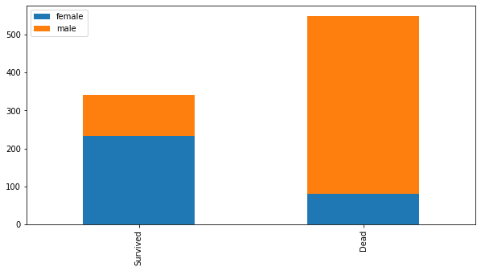

```python
import pandas as pd
import numpy as np
```


```python
EDA(Exploratory data analysis):탐색적 데이터 분석 -> 내가 직접 찾아보면서 데이터를 분석하겠다
```


```python
train=pd.read_csv("train.csv")
train.head(80)
train.shape
```


    (891, 12)


```python
train.isnull().sum(axis=0)
```


    PassengerId      0
    Survived         0
    Pclass           0
    Name             0
    Sex              0
    Age            177
    SibSp            0
    Parch            0
    Ticket           0
    Fare             0
    Cabin          687
    Embarked         2
    dtype: int64


```python
train[train['Survived']==1]    <-생존자의 정보만 골라서 볼 수 있음
```


<div>
<style scoped>
    .dataframe tbody tr th:only-of-type {
        vertical-align: middle;
    }

    .dataframe tbody tr th {
        vertical-align: top;
    }

    .dataframe thead th {
        text-align: right;
    }
</style>
<table border="1" class="dataframe">
  <thead>
    <tr style="text-align: right;">
      <th></th>
      <th>PassengerId</th>
      <th>Survived</th>
      <th>Pclass</th>
      <th>Name</th>
      <th>Sex</th>
      <th>Age</th>
      <th>SibSp</th>
      <th>Parch</th>
      <th>Ticket</th>
      <th>Fare</th>
      <th>Cabin</th>
      <th>Embarked</th>
    </tr>
  </thead>
  <tbody>
    <tr>
      <td>1</td>
      <td>2</td>
      <td>1</td>
      <td>1</td>
      <td>Cumings, Mrs. John Bradley (Florence Briggs Th...</td>
      <td>female</td>
      <td>38.0</td>
      <td>1</td>
      <td>0</td>
      <td>PC 17599</td>
      <td>71.2833</td>
      <td>C85</td>
      <td>C</td>
    </tr>
    <tr>
      <td>2</td>
      <td>3</td>
      <td>1</td>
      <td>3</td>
      <td>Heikkinen, Miss. Laina</td>
      <td>female</td>
      <td>26.0</td>
      <td>0</td>
      <td>0</td>
      <td>STON/O2. 3101282</td>
      <td>7.9250</td>
      <td>NaN</td>
      <td>S</td>
    </tr>
    <tr>
      <td>3</td>
      <td>4</td>
      <td>1</td>
      <td>1</td>
      <td>Futrelle, Mrs. Jacques Heath (Lily May Peel)</td>
      <td>female</td>
      <td>35.0</td>
      <td>1</td>
      <td>0</td>
      <td>113803</td>
      <td>53.1000</td>
      <td>C123</td>
      <td>S</td>
    </tr>
    <tr>
      <td>8</td>
      <td>9</td>
      <td>1</td>
      <td>3</td>
      <td>Johnson, Mrs. Oscar W (Elisabeth Vilhelmina Berg)</td>
      <td>female</td>
      <td>27.0</td>
      <td>0</td>
      <td>2</td>
      <td>347742</td>
      <td>11.1333</td>
      <td>NaN</td>
      <td>S</td>
    </tr>
    <tr>
      <td>9</td>
      <td>10</td>
      <td>1</td>
      <td>2</td>
      <td>Nasser, Mrs. Nicholas (Adele Achem)</td>
      <td>female</td>
      <td>14.0</td>
      <td>1</td>
      <td>0</td>
      <td>237736</td>
      <td>30.0708</td>
      <td>NaN</td>
      <td>C</td>
    </tr>
    <tr>
      <td>...</td>
      <td>...</td>
      <td>...</td>
      <td>...</td>
      <td>...</td>
      <td>...</td>
      <td>...</td>
      <td>...</td>
      <td>...</td>
      <td>...</td>
      <td>...</td>
      <td>...</td>
      <td>...</td>
    </tr>
    <tr>
      <td>875</td>
      <td>876</td>
      <td>1</td>
      <td>3</td>
      <td>Najib, Miss. Adele Kiamie "Jane"</td>
      <td>female</td>
      <td>15.0</td>
      <td>0</td>
      <td>0</td>
      <td>2667</td>
      <td>7.2250</td>
      <td>NaN</td>
      <td>C</td>
    </tr>
    <tr>
      <td>879</td>
      <td>880</td>
      <td>1</td>
      <td>1</td>
      <td>Potter, Mrs. Thomas Jr (Lily Alexenia Wilson)</td>
      <td>female</td>
      <td>56.0</td>
      <td>0</td>
      <td>1</td>
      <td>11767</td>
      <td>83.1583</td>
      <td>C50</td>
      <td>C</td>
    </tr>
    <tr>
      <td>880</td>
      <td>881</td>
      <td>1</td>
      <td>2</td>
      <td>Shelley, Mrs. William (Imanita Parrish Hall)</td>
      <td>female</td>
      <td>25.0</td>
      <td>0</td>
      <td>1</td>
      <td>230433</td>
      <td>26.0000</td>
      <td>NaN</td>
      <td>S</td>
    </tr>
    <tr>
      <td>887</td>
      <td>888</td>
      <td>1</td>
      <td>1</td>
      <td>Graham, Miss. Margaret Edith</td>
      <td>female</td>
      <td>19.0</td>
      <td>0</td>
      <td>0</td>
      <td>112053</td>
      <td>30.0000</td>
      <td>B42</td>
      <td>S</td>
    </tr>
    <tr>
      <td>889</td>
      <td>890</td>
      <td>1</td>
      <td>1</td>
      <td>Behr, Mr. Karl Howell</td>
      <td>male</td>
      <td>26.0</td>
      <td>0</td>
      <td>0</td>
      <td>111369</td>
      <td>30.0000</td>
      <td>C148</td>
      <td>C</td>
    </tr>
  </tbody>
</table>
<p>342 rows × 12 columns</p>
</div>


```python
train[train['Survived']==1]['Sex']
```


    1      female
    2      female
    3      female
    8      female
    9      female
            ...  
    875    female
    879    female
    880    female
    887    female
    889      male
    Name: Sex, Length: 342, dtype: object


```python
train[train['Survived']==1]['Sex'].value_counts()     <- 생존자의 성별을 구분해서 얻어줌
```


    female    233
    male      109
    Name: Sex, dtype: int64


```python
survived=train[train['Survived']==1]['Sex'].value_counts()
dead=train[train['Survived']==0]['Sex'].value_counts()
type(dead)
```


    pandas.core.series.Series


```python
df=pd.DataFrame([survived,dead])
df.index=['Survived','Dead']
df
```


<div>
<style scoped>
    .dataframe tbody tr th:only-of-type {
        vertical-align: middle;
    }

    .dataframe tbody tr th {
        vertical-align: top;
    }

    .dataframe thead th {
        text-align: right;
    }
</style>
<table border="1" class="dataframe">
  <thead>
    <tr style="text-align: right;">
      <th></th>
      <th>female</th>
      <th>male</th>
    </tr>
  </thead>
  <tbody>
    <tr>
      <td>Survived</td>
      <td>233</td>
      <td>109</td>
    </tr>
    <tr>
      <td>Dead</td>
      <td>81</td>
      <td>468</td>
    </tr>
  </tbody>
</table>
</div>


```python
import matplotlib.pyplot as plt
df.plot(kind="bar",stacked=True)
```


    <matplotlib.axes._subplots.AxesSubplot at 0x2961cd1f888>


```python
df.plot(kind="bar",stacked=True)
```


    <matplotlib.axes._subplots.AxesSubplot at 0x2961cd92b08>


```python
df.plot(kind="bar",stacked=True,figsize=(10,5))
```


    <matplotlib.axes._subplots.AxesSubplot at 0x2961c5bcb88>


```python
def my_chart(feature):  
    survived=train[train['Survived']==1][feature].value_counts()
    dead=train[train['Survived']==0][feature].value_counts()
    df=pd.DataFrame([survived,dead])
    df.index=['Survived','Dead']
    df.plot(kind="bar",stacked=True,figsize=(10,5))
```


```python
my_chart('Sex')
```





```python
my_chart('Embarked')
```


```python
my_chart('Parch')
```


```python
train['title']=train['Name'].str.extract(" ([A-Za-z]+)\.")
#train['Name']
train['title'].value_counts()
title_mappinng={"Mr":0,"Miss":1,"Mrs":2,"Master":3}
train['title']=train['title'].map(title_mappinng)
```


```python
train['title'].value_counts()
```


    0.0    517
    1.0    182
    2.0    125
    3.0     40
    Name: title, dtype: int64


```python
train.drop('Name',axis=1,inplace=True)    <-'Name'은 필요 없어서 지움, 지우고 원 데이터 대체
train
```


<div>
<style scoped>
    .dataframe tbody tr th:only-of-type {
        vertical-align: middle;
    }

    .dataframe tbody tr th {
        vertical-align: top;
    }

    .dataframe thead th {
        text-align: right;
    }
</style>
<table border="1" class="dataframe">
  <thead>
    <tr style="text-align: right;">
      <th></th>
      <th>PassengerId</th>
      <th>Survived</th>
      <th>Pclass</th>
      <th>Sex</th>
      <th>Age</th>
      <th>SibSp</th>
      <th>Parch</th>
      <th>Ticket</th>
      <th>Fare</th>
      <th>Cabin</th>
      <th>Embarked</th>
      <th>title</th>
    </tr>
  </thead>
  <tbody>
    <tr>
      <td>0</td>
      <td>1</td>
      <td>0</td>
      <td>3</td>
      <td>male</td>
      <td>22.0</td>
      <td>1</td>
      <td>0</td>
      <td>A/5 21171</td>
      <td>7.2500</td>
      <td>NaN</td>
      <td>S</td>
      <td>0.0</td>
    </tr>
    <tr>
      <td>1</td>
      <td>2</td>
      <td>1</td>
      <td>1</td>
      <td>female</td>
      <td>38.0</td>
      <td>1</td>
      <td>0</td>
      <td>PC 17599</td>
      <td>71.2833</td>
      <td>C85</td>
      <td>C</td>
      <td>2.0</td>
    </tr>
    <tr>
      <td>2</td>
      <td>3</td>
      <td>1</td>
      <td>3</td>
      <td>female</td>
      <td>26.0</td>
      <td>0</td>
      <td>0</td>
      <td>STON/O2. 3101282</td>
      <td>7.9250</td>
      <td>NaN</td>
      <td>S</td>
      <td>1.0</td>
    </tr>
    <tr>
      <td>3</td>
      <td>4</td>
      <td>1</td>
      <td>1</td>
      <td>female</td>
      <td>35.0</td>
      <td>1</td>
      <td>0</td>
      <td>113803</td>
      <td>53.1000</td>
      <td>C123</td>
      <td>S</td>
      <td>2.0</td>
    </tr>
    <tr>
      <td>4</td>
      <td>5</td>
      <td>0</td>
      <td>3</td>
      <td>male</td>
      <td>35.0</td>
      <td>0</td>
      <td>0</td>
      <td>373450</td>
      <td>8.0500</td>
      <td>NaN</td>
      <td>S</td>
      <td>0.0</td>
    </tr>
    <tr>
      <td>...</td>
      <td>...</td>
      <td>...</td>
      <td>...</td>
      <td>...</td>
      <td>...</td>
      <td>...</td>
      <td>...</td>
      <td>...</td>
      <td>...</td>
      <td>...</td>
      <td>...</td>
      <td>...</td>
    </tr>
    <tr>
      <td>886</td>
      <td>887</td>
      <td>0</td>
      <td>2</td>
      <td>male</td>
      <td>27.0</td>
      <td>0</td>
      <td>0</td>
      <td>211536</td>
      <td>13.0000</td>
      <td>NaN</td>
      <td>S</td>
      <td>NaN</td>
    </tr>
    <tr>
      <td>887</td>
      <td>888</td>
      <td>1</td>
      <td>1</td>
      <td>female</td>
      <td>19.0</td>
      <td>0</td>
      <td>0</td>
      <td>112053</td>
      <td>30.0000</td>
      <td>B42</td>
      <td>S</td>
      <td>1.0</td>
    </tr>
    <tr>
      <td>888</td>
      <td>889</td>
      <td>0</td>
      <td>3</td>
      <td>female</td>
      <td>NaN</td>
      <td>1</td>
      <td>2</td>
      <td>W./C. 6607</td>
      <td>23.4500</td>
      <td>NaN</td>
      <td>S</td>
      <td>1.0</td>
    </tr>
    <tr>
      <td>889</td>
      <td>890</td>
      <td>1</td>
      <td>1</td>
      <td>male</td>
      <td>26.0</td>
      <td>0</td>
      <td>0</td>
      <td>111369</td>
      <td>30.0000</td>
      <td>C148</td>
      <td>C</td>
      <td>0.0</td>
    </tr>
    <tr>
      <td>890</td>
      <td>891</td>
      <td>0</td>
      <td>3</td>
      <td>male</td>
      <td>32.0</td>
      <td>0</td>
      <td>0</td>
      <td>370376</td>
      <td>7.7500</td>
      <td>NaN</td>
      <td>Q</td>
      <td>0.0</td>
    </tr>
  </tbody>
</table>
<p>891 rows × 12 columns</p>
</div>


```python
Sex -> male:0, female:1
```


```python
sm={'male':0,'female':1}
train['Sex']=train['Sex'].map(sm)
train
```


<div>
<style scoped>
    .dataframe tbody tr th:only-of-type {
        vertical-align: middle;
    }

    .dataframe tbody tr th {
        vertical-align: top;
    }

    .dataframe thead th {
        text-align: right;
    }
</style>
<table border="1" class="dataframe">
  <thead>
    <tr style="text-align: right;">
      <th></th>
      <th>PassengerId</th>
      <th>Survived</th>
      <th>Pclass</th>
      <th>Sex</th>
      <th>Age</th>
      <th>SibSp</th>
      <th>Parch</th>
      <th>Ticket</th>
      <th>Fare</th>
      <th>Cabin</th>
      <th>Embarked</th>
      <th>title</th>
    </tr>
  </thead>
  <tbody>
    <tr>
      <td>0</td>
      <td>1</td>
      <td>0</td>
      <td>3</td>
      <td>0</td>
      <td>22.0</td>
      <td>1</td>
      <td>0</td>
      <td>A/5 21171</td>
      <td>7.2500</td>
      <td>NaN</td>
      <td>S</td>
      <td>0.0</td>
    </tr>
    <tr>
      <td>1</td>
      <td>2</td>
      <td>1</td>
      <td>1</td>
      <td>1</td>
      <td>38.0</td>
      <td>1</td>
      <td>0</td>
      <td>PC 17599</td>
      <td>71.2833</td>
      <td>C85</td>
      <td>C</td>
      <td>2.0</td>
    </tr>
    <tr>
      <td>2</td>
      <td>3</td>
      <td>1</td>
      <td>3</td>
      <td>1</td>
      <td>26.0</td>
      <td>0</td>
      <td>0</td>
      <td>STON/O2. 3101282</td>
      <td>7.9250</td>
      <td>NaN</td>
      <td>S</td>
      <td>1.0</td>
    </tr>
    <tr>
      <td>3</td>
      <td>4</td>
      <td>1</td>
      <td>1</td>
      <td>1</td>
      <td>35.0</td>
      <td>1</td>
      <td>0</td>
      <td>113803</td>
      <td>53.1000</td>
      <td>C123</td>
      <td>S</td>
      <td>2.0</td>
    </tr>
    <tr>
      <td>4</td>
      <td>5</td>
      <td>0</td>
      <td>3</td>
      <td>0</td>
      <td>35.0</td>
      <td>0</td>
      <td>0</td>
      <td>373450</td>
      <td>8.0500</td>
      <td>NaN</td>
      <td>S</td>
      <td>0.0</td>
    </tr>
    <tr>
      <td>...</td>
      <td>...</td>
      <td>...</td>
      <td>...</td>
      <td>...</td>
      <td>...</td>
      <td>...</td>
      <td>...</td>
      <td>...</td>
      <td>...</td>
      <td>...</td>
      <td>...</td>
      <td>...</td>
    </tr>
    <tr>
      <td>886</td>
      <td>887</td>
      <td>0</td>
      <td>2</td>
      <td>0</td>
      <td>27.0</td>
      <td>0</td>
      <td>0</td>
      <td>211536</td>
      <td>13.0000</td>
      <td>NaN</td>
      <td>S</td>
      <td>NaN</td>
    </tr>
    <tr>
      <td>887</td>
      <td>888</td>
      <td>1</td>
      <td>1</td>
      <td>1</td>
      <td>19.0</td>
      <td>0</td>
      <td>0</td>
      <td>112053</td>
      <td>30.0000</td>
      <td>B42</td>
      <td>S</td>
      <td>1.0</td>
    </tr>
    <tr>
      <td>888</td>
      <td>889</td>
      <td>0</td>
      <td>3</td>
      <td>1</td>
      <td>NaN</td>
      <td>1</td>
      <td>2</td>
      <td>W./C. 6607</td>
      <td>23.4500</td>
      <td>NaN</td>
      <td>S</td>
      <td>1.0</td>
    </tr>
    <tr>
      <td>889</td>
      <td>890</td>
      <td>1</td>
      <td>1</td>
      <td>0</td>
      <td>26.0</td>
      <td>0</td>
      <td>0</td>
      <td>111369</td>
      <td>30.0000</td>
      <td>C148</td>
      <td>C</td>
      <td>0.0</td>
    </tr>
    <tr>
      <td>890</td>
      <td>891</td>
      <td>0</td>
      <td>3</td>
      <td>0</td>
      <td>32.0</td>
      <td>0</td>
      <td>0</td>
      <td>370376</td>
      <td>7.7500</td>
      <td>NaN</td>
      <td>Q</td>
      <td>0.0</td>
    </tr>
  </tbody>
</table>
<p>891 rows × 12 columns</p>
</div>


```python
my_chart('Sex')
```


```python
train['Age']
Q.16세 이하: 0, 16~26이하:1, 26~36이하:2, 36~62:3, 62초과:4
```


```python
train[train['Age']<=16] <- 16세 이하인 사람만 뽑음
```


<div>
<style scoped>
    .dataframe tbody tr th:only-of-type {
        vertical-align: middle;
    }

    .dataframe tbody tr th {
        vertical-align: top;
    }

    .dataframe thead th {
        text-align: right;
    }
</style>
<table border="1" class="dataframe">
  <thead>
    <tr style="text-align: right;">
      <th></th>
      <th>PassengerId</th>
      <th>Survived</th>
      <th>Pclass</th>
      <th>Sex</th>
      <th>Age</th>
      <th>SibSp</th>
      <th>Parch</th>
      <th>Ticket</th>
      <th>Fare</th>
      <th>Cabin</th>
      <th>Embarked</th>
      <th>title</th>
    </tr>
  </thead>
  <tbody>
    <tr>
      <td>7</td>
      <td>8</td>
      <td>0</td>
      <td>3</td>
      <td>0</td>
      <td>2.0</td>
      <td>3</td>
      <td>1</td>
      <td>349909</td>
      <td>21.0750</td>
      <td>NaN</td>
      <td>S</td>
      <td>3.0</td>
    </tr>
    <tr>
      <td>9</td>
      <td>10</td>
      <td>1</td>
      <td>2</td>
      <td>1</td>
      <td>14.0</td>
      <td>1</td>
      <td>0</td>
      <td>237736</td>
      <td>30.0708</td>
      <td>NaN</td>
      <td>C</td>
      <td>2.0</td>
    </tr>
    <tr>
      <td>10</td>
      <td>11</td>
      <td>1</td>
      <td>3</td>
      <td>1</td>
      <td>4.0</td>
      <td>1</td>
      <td>1</td>
      <td>PP 9549</td>
      <td>16.7000</td>
      <td>G6</td>
      <td>S</td>
      <td>1.0</td>
    </tr>
    <tr>
      <td>14</td>
      <td>15</td>
      <td>0</td>
      <td>3</td>
      <td>1</td>
      <td>14.0</td>
      <td>0</td>
      <td>0</td>
      <td>350406</td>
      <td>7.8542</td>
      <td>NaN</td>
      <td>S</td>
      <td>1.0</td>
    </tr>
    <tr>
      <td>16</td>
      <td>17</td>
      <td>0</td>
      <td>3</td>
      <td>0</td>
      <td>2.0</td>
      <td>4</td>
      <td>1</td>
      <td>382652</td>
      <td>29.1250</td>
      <td>NaN</td>
      <td>Q</td>
      <td>3.0</td>
    </tr>
    <tr>
      <td>...</td>
      <td>...</td>
      <td>...</td>
      <td>...</td>
      <td>...</td>
      <td>...</td>
      <td>...</td>
      <td>...</td>
      <td>...</td>
      <td>...</td>
      <td>...</td>
      <td>...</td>
      <td>...</td>
    </tr>
    <tr>
      <td>850</td>
      <td>851</td>
      <td>0</td>
      <td>3</td>
      <td>0</td>
      <td>4.0</td>
      <td>4</td>
      <td>2</td>
      <td>347082</td>
      <td>31.2750</td>
      <td>NaN</td>
      <td>S</td>
      <td>3.0</td>
    </tr>
    <tr>
      <td>852</td>
      <td>853</td>
      <td>0</td>
      <td>3</td>
      <td>1</td>
      <td>9.0</td>
      <td>1</td>
      <td>1</td>
      <td>2678</td>
      <td>15.2458</td>
      <td>NaN</td>
      <td>C</td>
      <td>1.0</td>
    </tr>
    <tr>
      <td>853</td>
      <td>854</td>
      <td>1</td>
      <td>1</td>
      <td>1</td>
      <td>16.0</td>
      <td>0</td>
      <td>1</td>
      <td>PC 17592</td>
      <td>39.4000</td>
      <td>D28</td>
      <td>S</td>
      <td>1.0</td>
    </tr>
    <tr>
      <td>869</td>
      <td>870</td>
      <td>1</td>
      <td>3</td>
      <td>0</td>
      <td>4.0</td>
      <td>1</td>
      <td>1</td>
      <td>347742</td>
      <td>11.1333</td>
      <td>NaN</td>
      <td>S</td>
      <td>3.0</td>
    </tr>
    <tr>
      <td>875</td>
      <td>876</td>
      <td>1</td>
      <td>3</td>
      <td>1</td>
      <td>15.0</td>
      <td>0</td>
      <td>0</td>
      <td>2667</td>
      <td>7.2250</td>
      <td>NaN</td>
      <td>C</td>
      <td>1.0</td>
    </tr>
  </tbody>
</table>
<p>100 rows × 12 columns</p>
</div>


```python
train.loc[train['Age']<=16,'Age']=0
train.loc[(train['Age']>16) & (train['Age']<=26),'Age']=1
train.loc[(train['Age']>26) & (train['Age']<=36),'Age']=2
train.loc[(train['Age']>36) & (train['Age']<=62),'Age']=3
train.loc[train['Age']>64,'Age']=4
train['Age']
```


    0      0.0
    1      0.0
    2      0.0
    3      0.0
    4      0.0
          ... 
    886    0.0
    887    0.0
    888    NaN
    889    0.0
    890    0.0
    Name: Age, Length: 891, dtype: float64


```python

```


```python

```


```python

```


```python

```


```python

```


```python

```


```python

```
