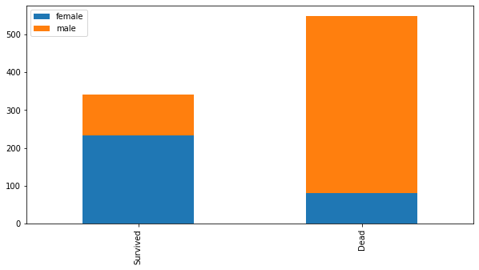

```python
*코랩(colab): jupyter를 구글 서벙서 동작
    -> 웹브라우저만 있으면 구동가능, 공유 용의, 데이터분석 패키지 설치
    -> GPU사용이 무료
    ->구글 로그인 -> colab.research.google.com
```


```python
*matplotlib: 차트 또는 plot으로 출력할 때 쓰는 library
```


```python
import numpy as np
import matplotlib.pyplot as plt

# Fixing random state for reproducibility
np.random.seed(19680801)

dt = 0.01
t = np.arange(0, 30, dt)
nse1 = np.random.randn(len(t))                 # white noise 1
nse2 = np.random.randn(len(t))                 # white noise 2

# Two signals with a coherent part at 10Hz and a random part
s1 = np.sin(2 * np.pi * 10 * t) + nse1
s2 = np.sin(2 * np.pi * 10 * t) + nse2

fig, axs = plt.subplots(2, 1)
axs[0].plot(t, s1, t, s2)
axs[0].set_xlim(0, 2)
axs[0].set_xlabel('time')
axs[0].set_ylabel('s1 and s2')
axs[0].grid(True)

cxy, f = axs[1].cohere(s1, s2, 256, 1. / dt)
axs[1].set_ylabel('coherence')

fig.tight_layout()
plt.show()

```


```python
import matplotlib as mpl
import matplotlib.pyplot as plt    <- 보통 import 할 때 mpl,plt로 함 
```


      File "<ipython-input-4-354d11c2b989>", line 2
        import matplotlib.pyplot as plt    <- 보통 import 할 때 mpl,plt로 함
                                           ^
    SyntaxError: invalid syntax
    


```python
import matplotlib.pylab as plt     <-수치해석 관련 소프트웨어:시각화 명령을 그대로 사용가능
```


```python
%matplotlib inline
#notebook 내부에 이미지 출력
```


```python
#lineplot
plt.title("plot")
plt.plot([10,20,30,40],[1,4,9,16],'rs-')
plt.xlabel("x axis")
plt.ylabel("y axis")
plt.show()
```


```python
plt.title("plot")
plt.plot([10,20,30,40],[1,4,9,16],'rs:')
plt.xlabel("x axis")
plt.ylabel("y axis")
plt.show()
```


```python
plt.title("plot")
plt.plot([10,20,30,40],[1,4,9,16],'rh:')
plt.xlabel("x axis")
plt.ylabel("y axis")
plt.show()
```


```python
plt.title("plot")
plt.plot([10,20,30,40],[1,4,9,16],'bx:')
plt.xlabel("x axis")
plt.ylabel("y axis")
plt.show()
```


```python
plt.title("plot")
plt.plot([10,20,30,40],[1,4,9,16],c='b')
plt.xlabel("x axis")
plt.ylabel("y axis")
plt.show()
```


```python
plt.title("plot")
plt.plot([10,20,30,40],[1,4,9,16],'rs-',lw=5,ls='--')
plt.xlabel("x axis")
plt.ylabel("y axis")
plt.show()
```


```python
plt.title("plot")
plt.plot([10,20,30,40],[1,4,9,16],'bs-',marker='o')
plt.xlabel("x axis")
plt.ylabel("y axis")
plt.show()
```


```python
plt.title("plot")
plt.plot([10,20,30,40],[1,4,9,16],'bs-',marker='o',ms='15')
plt.xlabel("x axis")
plt.ylabel("y axis")
plt.show()
```





```python
#틱설정: 플롯에서 축의 위치 표시 지점
#xticks, yticks
```


```python
*np.linspace()
```


```python
np.pi
```


    3.141592653589793


```python
np.linspace(-np.pi,np.pi,256)  <- -pi부터 pi까지 256등분한 값들
```


    array([-3.14159265, -3.11695271, -3.09231277, -3.06767283, -3.04303288,
           -3.01839294, -2.993753  , -2.96911306, -2.94447311, -2.91983317,
           -2.89519323, -2.87055329, -2.84591335, -2.8212734 , -2.79663346,
           -2.77199352, -2.74735358, -2.72271363, -2.69807369, -2.67343375,
           -2.64879381, -2.62415386, -2.59951392, -2.57487398, -2.55023404,
           -2.52559409, -2.50095415, -2.47631421, -2.45167427, -2.42703432,
           -2.40239438, -2.37775444, -2.3531145 , -2.32847456, -2.30383461,
           -2.27919467, -2.25455473, -2.22991479, -2.20527484, -2.1806349 ,
           -2.15599496, -2.13135502, -2.10671507, -2.08207513, -2.05743519,
           -2.03279525, -2.0081553 , -1.98351536, -1.95887542, -1.93423548,
           -1.90959553, -1.88495559, -1.86031565, -1.83567571, -1.81103577,
           -1.78639582, -1.76175588, -1.73711594, -1.712476  , -1.68783605,
           -1.66319611, -1.63855617, -1.61391623, -1.58927628, -1.56463634,
           -1.5399964 , -1.51535646, -1.49071651, -1.46607657, -1.44143663,
           -1.41679669, -1.39215674, -1.3675168 , -1.34287686, -1.31823692,
           -1.29359698, -1.26895703, -1.24431709, -1.21967715, -1.19503721,
           -1.17039726, -1.14575732, -1.12111738, -1.09647744, -1.07183749,
           -1.04719755, -1.02255761, -0.99791767, -0.97327772, -0.94863778,
           -0.92399784, -0.8993579 , -0.87471795, -0.85007801, -0.82543807,
           -0.80079813, -0.77615819, -0.75151824, -0.7268783 , -0.70223836,
           -0.67759842, -0.65295847, -0.62831853, -0.60367859, -0.57903865,
           -0.5543987 , -0.52975876, -0.50511882, -0.48047888, -0.45583893,
           -0.43119899, -0.40655905, -0.38191911, -0.35727916, -0.33263922,
           -0.30799928, -0.28335934, -0.2587194 , -0.23407945, -0.20943951,
           -0.18479957, -0.16015963, -0.13551968, -0.11087974, -0.0862398 ,
           -0.06159986, -0.03695991, -0.01231997,  0.01231997,  0.03695991,
            0.06159986,  0.0862398 ,  0.11087974,  0.13551968,  0.16015963,
            0.18479957,  0.20943951,  0.23407945,  0.2587194 ,  0.28335934,
            0.30799928,  0.33263922,  0.35727916,  0.38191911,  0.40655905,
            0.43119899,  0.45583893,  0.48047888,  0.50511882,  0.52975876,
            0.5543987 ,  0.57903865,  0.60367859,  0.62831853,  0.65295847,
            0.67759842,  0.70223836,  0.7268783 ,  0.75151824,  0.77615819,
            0.80079813,  0.82543807,  0.85007801,  0.87471795,  0.8993579 ,
            0.92399784,  0.94863778,  0.97327772,  0.99791767,  1.02255761,
            1.04719755,  1.07183749,  1.09647744,  1.12111738,  1.14575732,
            1.17039726,  1.19503721,  1.21967715,  1.24431709,  1.26895703,
            1.29359698,  1.31823692,  1.34287686,  1.3675168 ,  1.39215674,
            1.41679669,  1.44143663,  1.46607657,  1.49071651,  1.51535646,
            1.5399964 ,  1.56463634,  1.58927628,  1.61391623,  1.63855617,
            1.66319611,  1.68783605,  1.712476  ,  1.73711594,  1.76175588,
            1.78639582,  1.81103577,  1.83567571,  1.86031565,  1.88495559,
            1.90959553,  1.93423548,  1.95887542,  1.98351536,  2.0081553 ,
            2.03279525,  2.05743519,  2.08207513,  2.10671507,  2.13135502,
            2.15599496,  2.1806349 ,  2.20527484,  2.22991479,  2.25455473,
            2.27919467,  2.30383461,  2.32847456,  2.3531145 ,  2.37775444,
            2.40239438,  2.42703432,  2.45167427,  2.47631421,  2.50095415,
            2.52559409,  2.55023404,  2.57487398,  2.59951392,  2.62415386,
            2.64879381,  2.67343375,  2.69807369,  2.72271363,  2.74735358,
            2.77199352,  2.79663346,  2.8212734 ,  2.84591335,  2.87055329,
            2.89519323,  2.91983317,  2.94447311,  2.96911306,  2.993753  ,
            3.01839294,  3.04303288,  3.06767283,  3.09231277,  3.11695271,
            3.14159265])


```python
x=np.linspace(-2*np.pi,2*np.pi,256) 
```


```python
c,s=np.cos(x),np.sin(x)
```


```python
plt.plot(x,c)
```


    [<matplotlib.lines.Line2D at 0x182da2026c8>]


```python
plt.yticks([-1,-0.5,0,0.5,1])
plt.plot(x,c)
```


    [<matplotlib.lines.Line2D at 0x182d6e09148>]


```python
plt.xticks([-2*np.pi,-np.pi,0,np.pi,2*np.pi])
plt.plot(x,c)
```


    [<matplotlib.lines.Line2D at 0x182da330688>]


```python
t=np.arange(0,5,0.2)
plt.plot(t,t,'r--',t,0.5*t**2,'bs:')
```


    [<matplotlib.lines.Line2D at 0x182da7ec748>,
     <matplotlib.lines.Line2D at 0x182da7ec908>]


```python
x=np.linspace(-2*np.pi,2*np.pi,256) 
c,s=np.cos(x),np.sin(x)
plt.plot(x,c,ls='--',label='cosine')
plt.show()
```


```python
x=np.linspace(-2*np.pi,2*np.pi,256) 
c,s=np.cos(x),np.sin(x)
plt.plot(x,s,ls=':',label='sine')
plt.plot(x,c,ls='--',label='cosine')
plt.legend(loc=0)
plt.show()
```


```python
*figure(종이,도화지), axes(플롯), axis(축)
ex: 종이(figure)를 반으로 접어서(axes)
    각 axes에 접혀진 부분에 2차원 그림을 출력(axis)
```


```python
np.random.seed(0)
f1=plt.figure(figsize=(10,2))
plt.plot(np.random.rand(100))
plt.show()
```


```python
subplot(2,1,1)         <- 앞에 2개의 변수는 2행 1렬을 의미, 3번쨰 변수는 2개로 나누어진 것중 위에 것
subplot(2,1,2)         <- 2개로 나누어진 것 중 아랫것
```


    ---------------------------------------------------------------------------

    NameError                                 Traceback (most recent call last)

    <ipython-input-62-0fb1e04818a9> in <module>
    ----> 1 subplot(2,1,1)        # <- 앞에 2개의 변수는 2행 1렬을 의미, 3번쨰 변수는 2개로 나누어진 것중 위에 것
          2 subplot(2,1,2)        # <- 2개로 나누어진 것 중 아랫것
    

    NameError: name 'subplot' is not defined


```python
x1=np.linspace(0.0,5.0)
x1
```


    array([0.        , 0.10204082, 0.20408163, 0.30612245, 0.40816327,
           0.51020408, 0.6122449 , 0.71428571, 0.81632653, 0.91836735,
           1.02040816, 1.12244898, 1.2244898 , 1.32653061, 1.42857143,
           1.53061224, 1.63265306, 1.73469388, 1.83673469, 1.93877551,
           2.04081633, 2.14285714, 2.24489796, 2.34693878, 2.44897959,
           2.55102041, 2.65306122, 2.75510204, 2.85714286, 2.95918367,
           3.06122449, 3.16326531, 3.26530612, 3.36734694, 3.46938776,
           3.57142857, 3.67346939, 3.7755102 , 3.87755102, 3.97959184,
           4.08163265, 4.18367347, 4.28571429, 4.3877551 , 4.48979592,
           4.59183673, 4.69387755, 4.79591837, 4.89795918, 5.        ])


```python
x2=np.linspace(0.0,2.0)
x2
y1=np.cos(2*np.pi*x1)*np.exp(-x1)
y2=np.cos(2*np.pi*x2)
ax1=plt.subplot(2,1,1)
plt.title('table1')
plt.plot(x1,y1,'yo-')


ax2=plt.subplot(2,1,2)
plt.plot(x2,y2,'r.-')
plt.title('table2')

plt.tight_layout()
```


```python
fig, axes=plt.subplots(2,2)
```


```python
y=[2,3,1]
x=np.arange(len(y))   #[0,1,2]
plt.bar(x,y)
plt.xticks(x, ['가','나','다'])     # <- x축의 축 설정
plt.xlabel("가나다")     # <- 전체 축에 대한 이름
plt.show()
```


```python
import matplotlib
from matplotlib import font_manager, rc
import platform
if platform.system()=="Windows":
    font_name=font_manager.FontProperties(fname="c:/Windows/Fonts/malgun.ttf").get_name()
    rc('font', family=font_name)
matplotlib.rcParams['axes.unicode_minus']=False

import warnings
warnings.filterwarnings("ignore")
```


```python
x=np.linspace(0.1,2*np.pi,10)
plt.stem(x,np.cos(x),'-.')
plt.show()
```


```python
labels=['취업','결혼','출산','건강']
sizes=[15,30,45,10]
colors=["yellow","green","skyblue","lightcoral"]
ex=(0.1,0,0,0)
plt.pie(sizes, labels=labels, colors=colors,shadow=True,startangle=90
       ,explode=ex,autopct="%.1f%%")
plt.show()
```


```python
#hist:히스토그램
```


```python
x=np.random.randn(100)
arr,bins,patches=plt.hist(x,bins=10)
plt.show()
arr  <- 구간별로 나온 변수의 갯수들(도수)
```


    array([ 1.,  2.,  8., 17., 20., 19., 17., 10.,  4.,  2.])


```python
bins   <- 나누어진 구간
```


    array([-2.65917224, -2.16286334, -1.66655445, -1.17024556, -0.67393666,
           -0.17762777,  0.31868112,  0.81499002,  1.31129891,  1.8076078 ,
            2.3039167 ])


```python
*스캐터플롯: 상관관계
```


```python
x=np.random.normal(0,1,100)
y=np.random.normal(0,1,100)
plt.scatter(x,y)
plt.show()
```


```python
w=np.random.rand(30)     <- 무작위로 0~1 사이 숫자 추출
x=np.random.rand(30)  
y=np.random.rand(30)  
z=np.pi*(10*np.random.rand(30))**2
plt.scatter(w,x,c=y)   <- y를 추가해 한 차원 증가(색으로)
plt.show()
```


```python
w=np.random.rand(30)    # <- 무작위로 0~1 사이 숫자 추출
x=np.random.rand(30)  
y=np.random.rand(30)  
z=np.pi*(10*np.random.rand(30))**2
plt.scatter(w,x,s=z,c=y)   <-크기로 또 추가
plt.show()
```


```python
from sklearn.datasets import load_digits
```


```python
digits=load_digits()
x=digits.images[2]
x
```


    array([[ 0.,  0.,  0.,  4., 15., 12.,  0.,  0.],
           [ 0.,  0.,  3., 16., 15., 14.,  0.,  0.],
           [ 0.,  0.,  8., 13.,  8., 16.,  0.,  0.],
           [ 0.,  0.,  1.,  6., 15., 11.,  0.,  0.],
           [ 0.,  1.,  8., 13., 15.,  1.,  0.,  0.],
           [ 0.,  9., 16., 16.,  5.,  0.,  0.,  0.],
           [ 0.,  3., 13., 16., 16., 11.,  5.,  0.],
           [ 0.,  0.,  0.,  3., 11., 16.,  9.,  0.]])


```python
plt.imshow(x,cmap=plt.cm.bone_r)
```


    <matplotlib.image.AxesImage at 0x182dfc86f08>


```python
import seaborn as sns
```


```python
anscombe=sns.load_dataset("anscombe")
anscombe
```


<div>
<style scoped>
    .dataframe tbody tr th:only-of-type {
        vertical-align: middle;
    }

    .dataframe tbody tr th {
        vertical-align: top;
    }

    .dataframe thead th {
        text-align: right;
    }
</style>
<table border="1" class="dataframe">
  <thead>
    <tr style="text-align: right;">
      <th></th>
      <th>dataset</th>
      <th>x</th>
      <th>y</th>
    </tr>
  </thead>
  <tbody>
    <tr>
      <td>0</td>
      <td>I</td>
      <td>10.0</td>
      <td>8.04</td>
    </tr>
    <tr>
      <td>1</td>
      <td>I</td>
      <td>8.0</td>
      <td>6.95</td>
    </tr>
    <tr>
      <td>2</td>
      <td>I</td>
      <td>13.0</td>
      <td>7.58</td>
    </tr>
    <tr>
      <td>3</td>
      <td>I</td>
      <td>9.0</td>
      <td>8.81</td>
    </tr>
    <tr>
      <td>4</td>
      <td>I</td>
      <td>11.0</td>
      <td>8.33</td>
    </tr>
    <tr>
      <td>5</td>
      <td>I</td>
      <td>14.0</td>
      <td>9.96</td>
    </tr>
    <tr>
      <td>6</td>
      <td>I</td>
      <td>6.0</td>
      <td>7.24</td>
    </tr>
    <tr>
      <td>7</td>
      <td>I</td>
      <td>4.0</td>
      <td>4.26</td>
    </tr>
    <tr>
      <td>8</td>
      <td>I</td>
      <td>12.0</td>
      <td>10.84</td>
    </tr>
    <tr>
      <td>9</td>
      <td>I</td>
      <td>7.0</td>
      <td>4.82</td>
    </tr>
    <tr>
      <td>10</td>
      <td>I</td>
      <td>5.0</td>
      <td>5.68</td>
    </tr>
    <tr>
      <td>11</td>
      <td>II</td>
      <td>10.0</td>
      <td>9.14</td>
    </tr>
    <tr>
      <td>12</td>
      <td>II</td>
      <td>8.0</td>
      <td>8.14</td>
    </tr>
    <tr>
      <td>13</td>
      <td>II</td>
      <td>13.0</td>
      <td>8.74</td>
    </tr>
    <tr>
      <td>14</td>
      <td>II</td>
      <td>9.0</td>
      <td>8.77</td>
    </tr>
    <tr>
      <td>15</td>
      <td>II</td>
      <td>11.0</td>
      <td>9.26</td>
    </tr>
    <tr>
      <td>16</td>
      <td>II</td>
      <td>14.0</td>
      <td>8.10</td>
    </tr>
    <tr>
      <td>17</td>
      <td>II</td>
      <td>6.0</td>
      <td>6.13</td>
    </tr>
    <tr>
      <td>18</td>
      <td>II</td>
      <td>4.0</td>
      <td>3.10</td>
    </tr>
    <tr>
      <td>19</td>
      <td>II</td>
      <td>12.0</td>
      <td>9.13</td>
    </tr>
    <tr>
      <td>20</td>
      <td>II</td>
      <td>7.0</td>
      <td>7.26</td>
    </tr>
    <tr>
      <td>21</td>
      <td>II</td>
      <td>5.0</td>
      <td>4.74</td>
    </tr>
    <tr>
      <td>22</td>
      <td>III</td>
      <td>10.0</td>
      <td>7.46</td>
    </tr>
    <tr>
      <td>23</td>
      <td>III</td>
      <td>8.0</td>
      <td>6.77</td>
    </tr>
    <tr>
      <td>24</td>
      <td>III</td>
      <td>13.0</td>
      <td>12.74</td>
    </tr>
    <tr>
      <td>25</td>
      <td>III</td>
      <td>9.0</td>
      <td>7.11</td>
    </tr>
    <tr>
      <td>26</td>
      <td>III</td>
      <td>11.0</td>
      <td>7.81</td>
    </tr>
    <tr>
      <td>27</td>
      <td>III</td>
      <td>14.0</td>
      <td>8.84</td>
    </tr>
    <tr>
      <td>28</td>
      <td>III</td>
      <td>6.0</td>
      <td>6.08</td>
    </tr>
    <tr>
      <td>29</td>
      <td>III</td>
      <td>4.0</td>
      <td>5.39</td>
    </tr>
    <tr>
      <td>30</td>
      <td>III</td>
      <td>12.0</td>
      <td>8.15</td>
    </tr>
    <tr>
      <td>31</td>
      <td>III</td>
      <td>7.0</td>
      <td>6.42</td>
    </tr>
    <tr>
      <td>32</td>
      <td>III</td>
      <td>5.0</td>
      <td>5.73</td>
    </tr>
    <tr>
      <td>33</td>
      <td>IV</td>
      <td>8.0</td>
      <td>6.58</td>
    </tr>
    <tr>
      <td>34</td>
      <td>IV</td>
      <td>8.0</td>
      <td>5.76</td>
    </tr>
    <tr>
      <td>35</td>
      <td>IV</td>
      <td>8.0</td>
      <td>7.71</td>
    </tr>
    <tr>
      <td>36</td>
      <td>IV</td>
      <td>8.0</td>
      <td>8.84</td>
    </tr>
    <tr>
      <td>37</td>
      <td>IV</td>
      <td>8.0</td>
      <td>8.47</td>
    </tr>
    <tr>
      <td>38</td>
      <td>IV</td>
      <td>8.0</td>
      <td>7.04</td>
    </tr>
    <tr>
      <td>39</td>
      <td>IV</td>
      <td>8.0</td>
      <td>5.25</td>
    </tr>
    <tr>
      <td>40</td>
      <td>IV</td>
      <td>19.0</td>
      <td>12.50</td>
    </tr>
    <tr>
      <td>41</td>
      <td>IV</td>
      <td>8.0</td>
      <td>5.56</td>
    </tr>
    <tr>
      <td>42</td>
      <td>IV</td>
      <td>8.0</td>
      <td>7.91</td>
    </tr>
    <tr>
      <td>43</td>
      <td>IV</td>
      <td>8.0</td>
      <td>6.89</td>
    </tr>
  </tbody>
</table>
</div>


```python
anscombe['dataset'].unique()
```


    array(['I', 'II', 'III', 'IV'], dtype=object)


```python
d1=anscombe[anscombe['dataset']=='I']
plt.plot(d1['x'],d1['y'],'o')
```


    [<matplotlib.lines.Line2D at 0x182e0be1cc8>]


```python
'II', 'III', 'IV'
d2=anscombe[anscombe['dataset']=='II']
d3=anscombe[anscombe['dataset']=='III']
d4=anscombe[anscombe['dataset']=='IV']
```


```python
fig=plt.figure()
axes1=fig.add_subplot(2,2,1)
axes2=fig.add_subplot(2,2,2)
axes3=fig.add_subplot(2,2,3)
axes4=fig.add_subplot(2,2,4)
```


```python
axes1.plot(d1['x'],d1['y'],'o')
axes2.plot(d2['x'],d2['y'],'o')
axes3.plot(d3['x'],d3['y'],'o')
axes4.plot(d4['x'],d4['y'],'o')
fig
```


```python
axes1.set_title("dataset1")
axes2.set_title("dataset2")
axes3.set_title("dataset3")
axes4.set_title("dataset4")
fig.tight_layout()
fig.suptitle("Anscome data")
fig.tight_layout()
fig   # <- 전체를 출력하는 명령어
```


```python
tips=sns.load_dataset("tips")
tips
```


<div>
<style scoped>
    .dataframe tbody tr th:only-of-type {
        vertical-align: middle;
    }

    .dataframe tbody tr th {
        vertical-align: top;
    }

    .dataframe thead th {
        text-align: right;
    }
</style>
<table border="1" class="dataframe">
  <thead>
    <tr style="text-align: right;">
      <th></th>
      <th>total_bill</th>
      <th>tip</th>
      <th>sex</th>
      <th>smoker</th>
      <th>day</th>
      <th>time</th>
      <th>size</th>
    </tr>
  </thead>
  <tbody>
    <tr>
      <td>0</td>
      <td>16.99</td>
      <td>1.01</td>
      <td>Female</td>
      <td>No</td>
      <td>Sun</td>
      <td>Dinner</td>
      <td>2</td>
    </tr>
    <tr>
      <td>1</td>
      <td>10.34</td>
      <td>1.66</td>
      <td>Male</td>
      <td>No</td>
      <td>Sun</td>
      <td>Dinner</td>
      <td>3</td>
    </tr>
    <tr>
      <td>2</td>
      <td>21.01</td>
      <td>3.50</td>
      <td>Male</td>
      <td>No</td>
      <td>Sun</td>
      <td>Dinner</td>
      <td>3</td>
    </tr>
    <tr>
      <td>3</td>
      <td>23.68</td>
      <td>3.31</td>
      <td>Male</td>
      <td>No</td>
      <td>Sun</td>
      <td>Dinner</td>
      <td>2</td>
    </tr>
    <tr>
      <td>4</td>
      <td>24.59</td>
      <td>3.61</td>
      <td>Female</td>
      <td>No</td>
      <td>Sun</td>
      <td>Dinner</td>
      <td>4</td>
    </tr>
    <tr>
      <td>...</td>
      <td>...</td>
      <td>...</td>
      <td>...</td>
      <td>...</td>
      <td>...</td>
      <td>...</td>
      <td>...</td>
    </tr>
    <tr>
      <td>239</td>
      <td>29.03</td>
      <td>5.92</td>
      <td>Male</td>
      <td>No</td>
      <td>Sat</td>
      <td>Dinner</td>
      <td>3</td>
    </tr>
    <tr>
      <td>240</td>
      <td>27.18</td>
      <td>2.00</td>
      <td>Female</td>
      <td>Yes</td>
      <td>Sat</td>
      <td>Dinner</td>
      <td>2</td>
    </tr>
    <tr>
      <td>241</td>
      <td>22.67</td>
      <td>2.00</td>
      <td>Male</td>
      <td>Yes</td>
      <td>Sat</td>
      <td>Dinner</td>
      <td>2</td>
    </tr>
    <tr>
      <td>242</td>
      <td>17.82</td>
      <td>1.75</td>
      <td>Male</td>
      <td>No</td>
      <td>Sat</td>
      <td>Dinner</td>
      <td>2</td>
    </tr>
    <tr>
      <td>243</td>
      <td>18.78</td>
      <td>3.00</td>
      <td>Female</td>
      <td>No</td>
      <td>Thur</td>
      <td>Dinner</td>
      <td>2</td>
    </tr>
  </tbody>
</table>
<p>244 rows × 7 columns</p>
</div>


```python
tips.columns
```


    Index(['total_bill', 'tip', 'sex', 'smoker', 'day', 'time', 'size'], dtype='object')


```python
fig=plt.figure()
axes1=fig.add_subplot(1,1,1)
axes1
```


    <matplotlib.axes._subplots.AxesSubplot at 0x182e0fb0f08>


```python
axes1.hist(tips['total_bill'],bins=6)
fig
```


```python
scPlot=plt.figure()
axes1=scPlot.add_subplot(1,1,1)
axes1.scatter(tips['total_bill'],tips['tip'])
```


    <matplotlib.collections.PathCollection at 0x182e21c1948>


```python
boxPlot=plt.figure()
axes1=boxPlot.add_subplot(1,1,1)
axes1.boxplot(
    [tips[tips['sex']=='Female']['tip'],
              tips[tips['sex']=='Male']['tip']],
              labels=['Female','Male'])
boxPlot    <- 백분위수, 휘슬, outlier등 많은 것을 알려줌
```


```python
tips['sex']
#Female => 0 , Male => 1 로 바꾸기

tips[tips['sex']=='Female']

tips['sex_color']=tips['sex'].map({'Female':0,'Male':1})
tips
```


<div>
<style scoped>
    .dataframe tbody tr th:only-of-type {
        vertical-align: middle;
    }

    .dataframe tbody tr th {
        vertical-align: top;
    }

    .dataframe thead th {
        text-align: right;
    }
</style>
<table border="1" class="dataframe">
  <thead>
    <tr style="text-align: right;">
      <th></th>
      <th>total_bill</th>
      <th>tip</th>
      <th>sex</th>
      <th>smoker</th>
      <th>day</th>
      <th>time</th>
      <th>size</th>
      <th>sex_color</th>
    </tr>
  </thead>
  <tbody>
    <tr>
      <td>0</td>
      <td>16.99</td>
      <td>1.01</td>
      <td>Female</td>
      <td>No</td>
      <td>Sun</td>
      <td>Dinner</td>
      <td>2</td>
      <td>0</td>
    </tr>
    <tr>
      <td>1</td>
      <td>10.34</td>
      <td>1.66</td>
      <td>Male</td>
      <td>No</td>
      <td>Sun</td>
      <td>Dinner</td>
      <td>3</td>
      <td>1</td>
    </tr>
    <tr>
      <td>2</td>
      <td>21.01</td>
      <td>3.50</td>
      <td>Male</td>
      <td>No</td>
      <td>Sun</td>
      <td>Dinner</td>
      <td>3</td>
      <td>1</td>
    </tr>
    <tr>
      <td>3</td>
      <td>23.68</td>
      <td>3.31</td>
      <td>Male</td>
      <td>No</td>
      <td>Sun</td>
      <td>Dinner</td>
      <td>2</td>
      <td>1</td>
    </tr>
    <tr>
      <td>4</td>
      <td>24.59</td>
      <td>3.61</td>
      <td>Female</td>
      <td>No</td>
      <td>Sun</td>
      <td>Dinner</td>
      <td>4</td>
      <td>0</td>
    </tr>
    <tr>
      <td>...</td>
      <td>...</td>
      <td>...</td>
      <td>...</td>
      <td>...</td>
      <td>...</td>
      <td>...</td>
      <td>...</td>
      <td>...</td>
    </tr>
    <tr>
      <td>239</td>
      <td>29.03</td>
      <td>5.92</td>
      <td>Male</td>
      <td>No</td>
      <td>Sat</td>
      <td>Dinner</td>
      <td>3</td>
      <td>1</td>
    </tr>
    <tr>
      <td>240</td>
      <td>27.18</td>
      <td>2.00</td>
      <td>Female</td>
      <td>Yes</td>
      <td>Sat</td>
      <td>Dinner</td>
      <td>2</td>
      <td>0</td>
    </tr>
    <tr>
      <td>241</td>
      <td>22.67</td>
      <td>2.00</td>
      <td>Male</td>
      <td>Yes</td>
      <td>Sat</td>
      <td>Dinner</td>
      <td>2</td>
      <td>1</td>
    </tr>
    <tr>
      <td>242</td>
      <td>17.82</td>
      <td>1.75</td>
      <td>Male</td>
      <td>No</td>
      <td>Sat</td>
      <td>Dinner</td>
      <td>2</td>
      <td>1</td>
    </tr>
    <tr>
      <td>243</td>
      <td>18.78</td>
      <td>3.00</td>
      <td>Female</td>
      <td>No</td>
      <td>Thur</td>
      <td>Dinner</td>
      <td>2</td>
      <td>0</td>
    </tr>
  </tbody>
</table>
<p>244 rows × 8 columns</p>
</div>


```python
def enc(s):
    if s=='Female':
        return 0
    else:
        return 1
# tips.apply(사용자정의함수)
tips['sex_color']=tips['sex'].apply(enc)
```


```python
tips
```


<div>
<style scoped>
    .dataframe tbody tr th:only-of-type {
        vertical-align: middle;
    }

    .dataframe tbody tr th {
        vertical-align: top;
    }

    .dataframe thead th {
        text-align: right;
    }
</style>
<table border="1" class="dataframe">
  <thead>
    <tr style="text-align: right;">
      <th></th>
      <th>total_bill</th>
      <th>tip</th>
      <th>sex</th>
      <th>smoker</th>
      <th>day</th>
      <th>time</th>
      <th>size</th>
      <th>sex_color</th>
    </tr>
  </thead>
  <tbody>
    <tr>
      <td>0</td>
      <td>16.99</td>
      <td>1.01</td>
      <td>Female</td>
      <td>No</td>
      <td>Sun</td>
      <td>Dinner</td>
      <td>2</td>
      <td>0</td>
    </tr>
    <tr>
      <td>1</td>
      <td>10.34</td>
      <td>1.66</td>
      <td>Male</td>
      <td>No</td>
      <td>Sun</td>
      <td>Dinner</td>
      <td>3</td>
      <td>1</td>
    </tr>
    <tr>
      <td>2</td>
      <td>21.01</td>
      <td>3.50</td>
      <td>Male</td>
      <td>No</td>
      <td>Sun</td>
      <td>Dinner</td>
      <td>3</td>
      <td>1</td>
    </tr>
    <tr>
      <td>3</td>
      <td>23.68</td>
      <td>3.31</td>
      <td>Male</td>
      <td>No</td>
      <td>Sun</td>
      <td>Dinner</td>
      <td>2</td>
      <td>1</td>
    </tr>
    <tr>
      <td>4</td>
      <td>24.59</td>
      <td>3.61</td>
      <td>Female</td>
      <td>No</td>
      <td>Sun</td>
      <td>Dinner</td>
      <td>4</td>
      <td>0</td>
    </tr>
    <tr>
      <td>...</td>
      <td>...</td>
      <td>...</td>
      <td>...</td>
      <td>...</td>
      <td>...</td>
      <td>...</td>
      <td>...</td>
      <td>...</td>
    </tr>
    <tr>
      <td>239</td>
      <td>29.03</td>
      <td>5.92</td>
      <td>Male</td>
      <td>No</td>
      <td>Sat</td>
      <td>Dinner</td>
      <td>3</td>
      <td>1</td>
    </tr>
    <tr>
      <td>240</td>
      <td>27.18</td>
      <td>2.00</td>
      <td>Female</td>
      <td>Yes</td>
      <td>Sat</td>
      <td>Dinner</td>
      <td>2</td>
      <td>0</td>
    </tr>
    <tr>
      <td>241</td>
      <td>22.67</td>
      <td>2.00</td>
      <td>Male</td>
      <td>Yes</td>
      <td>Sat</td>
      <td>Dinner</td>
      <td>2</td>
      <td>1</td>
    </tr>
    <tr>
      <td>242</td>
      <td>17.82</td>
      <td>1.75</td>
      <td>Male</td>
      <td>No</td>
      <td>Sat</td>
      <td>Dinner</td>
      <td>2</td>
      <td>1</td>
    </tr>
    <tr>
      <td>243</td>
      <td>18.78</td>
      <td>3.00</td>
      <td>Female</td>
      <td>No</td>
      <td>Thur</td>
      <td>Dinner</td>
      <td>2</td>
      <td>0</td>
    </tr>
  </tbody>
</table>
<p>244 rows × 8 columns</p>
</div>


```python
sPlot=plt.figure()
axes1=sPlot.add_subplot(1,1,1)
axes1.scatter(x=tips['total_bill'],
             y=tips['tip'],
             s=tips['size']*10,
             c=tips['sex_color'],
             alpha=1.5)
```


    <matplotlib.collections.PathCollection at 0x182e255d108>


```python
import seaborn as sns
```


```python
ax=plt.subplots()
sns.distplot(tips['total_bill'],kde=False)   <- kde를 False로 주면 밀집도 부분이 빠짐,  
                                            distplot은 seaborn에서 히스토그램을 그릴때 쓰는 함수
```


    <matplotlib.axes._subplots.AxesSubplot at 0x182e25d9848>


```python
ax=sns.distplot(tips['total_bill'],rug=True)  <- 보통 양탄자 그래프라고 부름
```


```python
ax=plt.subplots()
sns.countplot('day',data=tips)   <-tips에서 'day'를 count해서 보여줌
```


    <matplotlib.axes._subplots.AxesSubplot at 0x182e2865c08>


```python

```


```python

```


```python

```


```python

```


```python

```


```python

```


```python

```


```python

```


```python

```


```python

```


```python

```


```python

```


```python

```


```python

```


```python

```


```python

```


```python

```
