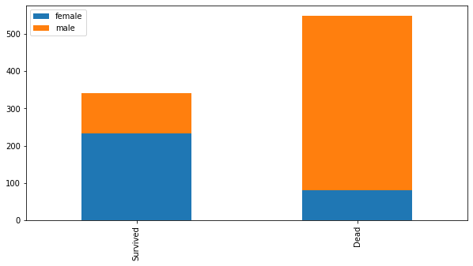

```python
import seaborn as sns
import matplotlib.pyplot as plt
```


```python
ax=plt.subplots()
```


```python
tips=sns.load_dataset('tips')
tips
ax=sns.regplot(x='total_bill', y='tip', data=tips, fit_reg=False) # <- False면 선은 안그려짐
ax.set_xlabel('TotalBill')
ax.set_ylabel('Tip')
ax.set_title('Total bill and Tip')
```


    Text(0.5, 1.0, 'Total bill and Tip')


```python
joint=sns.jointplot(x='total_bill', y='tip', data=tips,kind='hex') #<- hex로 어디에 많이 분포되어 있는지 
joint.set_axis_labels(xlabel='Total_bill',ylabel='Tip')
```


    <seaborn.axisgrid.JointGrid at 0x1dcde849f08>


```python
#이차원 밀집도 그래프
kde, ax=plt.subplots()   # <- 객채를 이렇게 만듬
sns.kdeplot(data=tips['total_bill'],
           data2=tips['tip'],shade=True)
ax.set_title('Kernel Density Plot')
```


    Text(0.5, 1.0, 'Kernel Density Plot')


```python
ax=plt.subplots()
ax=sns.barplot(x='time', y='total_bill', data=tips)
```


    <matplotlib.axes._subplots.AxesSubplot at 0x1dcdfb68bc8>


```python
ax=plt.subplots()
ax=sns.boxplot(x='total_bill', data=tips)
```


```python
ax=plt.subplots()
ax=sns.boxplot(x='total_bill', data=tips, orient='v')     #<- 'v'로 세로방향으로 바꿈
```


```python
ax=sns.boxplot(x='day',y='total_bill', data=tips, orient='v') 
#box의 아랫변, 윗변은 1사분위와 3사분위수, 가운데선은 중위수(median)
```


```python
ax=sns.boxplot(x='day',y='total_bill', data=tips, hue='smoker', palette='muted') 
```


```python
ax=sns.boxplot(x='day',y='total_bill', data=tips, hue='smoker', palette='Set3') 
ax=sns.swarmplot(x='day',y='total_bill', data=tips)
```


```python
sns.swarmplot(x='day',y='total_bill', data=tips)
```


    <matplotlib.axes._subplots.AxesSubplot at 0x1dce014b8c8>





```python
ax=plt.subplots()
sns.violinplot(x='time', y='total_bill', data=tips)
```


    <matplotlib.axes._subplots.AxesSubplot at 0x1dcdff938c8>


```python
#관계그래프
sns.pairplot(tips)   # <- 수치에 관한 그래프는 다 찾아줌
```


    <seaborn.axisgrid.PairGrid at 0x1dce023ec48>


```python
pg=sns.PairGrid(tips)
pg.map_upper(sns.regplot)                  # <- 대각요소 보다 위쪽에 reg 를 ㅈ정
pg.map_lower(sns.kdeplot)                  # <- 대각요소 보다 아래쪽에 kde를 지정
pg.map_diag(sns.distplot, rug = True)                # <- 대각요소에는 distplot을 지정
```


    <seaborn.axisgrid.PairGrid at 0x1dce2a50a08>


```python
iris=sns.load_dataset('iris')
titanic=sns.load_dataset('titanic')
flights=sns.load_dataset('flights')
```


```python
iris.head()
```


<div>
<style scoped>
    .dataframe tbody tr th:only-of-type {
        vertical-align: middle;
    }

    .dataframe tbody tr th {
        vertical-align: top;
    }

    .dataframe thead th {
        text-align: right;
    }
</style>
<table border="1" class="dataframe">
  <thead>
    <tr style="text-align: right;">
      <th></th>
      <th>sepal_length</th>
      <th>sepal_width</th>
      <th>petal_length</th>
      <th>petal_width</th>
      <th>species</th>
    </tr>
  </thead>
  <tbody>
    <tr>
      <td>0</td>
      <td>5.1</td>
      <td>3.5</td>
      <td>1.4</td>
      <td>0.2</td>
      <td>setosa</td>
    </tr>
    <tr>
      <td>1</td>
      <td>4.9</td>
      <td>3.0</td>
      <td>1.4</td>
      <td>0.2</td>
      <td>setosa</td>
    </tr>
    <tr>
      <td>2</td>
      <td>4.7</td>
      <td>3.2</td>
      <td>1.3</td>
      <td>0.2</td>
      <td>setosa</td>
    </tr>
    <tr>
      <td>3</td>
      <td>4.6</td>
      <td>3.1</td>
      <td>1.5</td>
      <td>0.2</td>
      <td>setosa</td>
    </tr>
    <tr>
      <td>4</td>
      <td>5.0</td>
      <td>3.6</td>
      <td>1.4</td>
      <td>0.2</td>
      <td>setosa</td>
    </tr>
  </tbody>
</table>
</div>


```python
x=iris.petal_length.values
sns.rugplot(x)
```


    <matplotlib.axes._subplots.AxesSubplot at 0x1dce436fc08>


```python
sns.kdeplot(x)
```


    <matplotlib.axes._subplots.AxesSubplot at 0x1dce413f408>


```python
sns.distplot(x, kde=True, rug=False)
```


    <matplotlib.axes._subplots.AxesSubplot at 0x1dce44f99c8>


```python
sns.distplot(x, kde=True, rug=True)
```


    <matplotlib.axes._subplots.AxesSubplot at 0x1dce44a3b88>


```python
#countplot:각 종류별 데이터가 얼마나 있는지 표시
sns.countplot(x='class',data=titanic)   
```


    <matplotlib.axes._subplots.AxesSubplot at 0x1dce46d6788>


```python
sns.countplot(x='day',data=tips)   
```


    <matplotlib.axes._subplots.AxesSubplot at 0x1dce473e5c8>


```python
"""
-1차원 데이터: 실수값, 실수 분포 plot
(커널밀도, rug, rugplot, distplot, kdeplot)

countplot:카테고리별 데이터가 얼마나 있는지 나타낼 때

다차원데이터(변수가 여러개)
-2차원 실수형 데이터: Scatterplot(jointplot)
-3차원 이상의 실수형 데이터: pairplot(그리드 형태로 출력)
(만약 카테고리형 데이터가 포함되어 있다면 hue속성을 지정)

-2차원 카테고리형 데이터: heatmap

-2차원 실수값, 카테고리형 데이터가 섞여있다
bar, box, point, violin, swarm plot 등
"""
```


```python
#2차원, 연속적인 실수값
sns.jointplot(x='sepal_length', y='sepal_width', data=iris, kind='scatter')
```


    <seaborn.axisgrid.JointGrid at 0x1dce469b7c8>


```python
sns.jointplot(x='sepal_length', y='sepal_width', data=iris, kind='kde')
```


    <seaborn.axisgrid.JointGrid at 0x1dce4b13348>


```python
#3차원 이상 데이터
sns.pairplot(iris)
```


    <seaborn.axisgrid.PairGrid at 0x1dce4e11ec8>


```python
sns.pairplot(iris,hue='species',markers=['o','s','d'])    <-marker를 지정해줘서 구분이 용이함
```


    <seaborn.axisgrid.PairGrid at 0x1dce7363788>


```python
#2차원데이터, 모든 값이 카테고리형
#heatmap
titanic.head()
```


<div>
<style scoped>
    .dataframe tbody tr th:only-of-type {
        vertical-align: middle;
    }

    .dataframe tbody tr th {
        vertical-align: top;
    }

    .dataframe thead th {
        text-align: right;
    }
</style>
<table border="1" class="dataframe">
  <thead>
    <tr style="text-align: right;">
      <th></th>
      <th>survived</th>
      <th>pclass</th>
      <th>sex</th>
      <th>age</th>
      <th>sibsp</th>
      <th>parch</th>
      <th>fare</th>
      <th>embarked</th>
      <th>class</th>
      <th>who</th>
      <th>adult_male</th>
      <th>deck</th>
      <th>embark_town</th>
      <th>alive</th>
      <th>alone</th>
    </tr>
  </thead>
  <tbody>
    <tr>
      <td>0</td>
      <td>0</td>
      <td>3</td>
      <td>male</td>
      <td>22.0</td>
      <td>1</td>
      <td>0</td>
      <td>7.2500</td>
      <td>S</td>
      <td>Third</td>
      <td>man</td>
      <td>True</td>
      <td>NaN</td>
      <td>Southampton</td>
      <td>no</td>
      <td>False</td>
    </tr>
    <tr>
      <td>1</td>
      <td>1</td>
      <td>1</td>
      <td>female</td>
      <td>38.0</td>
      <td>1</td>
      <td>0</td>
      <td>71.2833</td>
      <td>C</td>
      <td>First</td>
      <td>woman</td>
      <td>False</td>
      <td>C</td>
      <td>Cherbourg</td>
      <td>yes</td>
      <td>False</td>
    </tr>
    <tr>
      <td>2</td>
      <td>1</td>
      <td>3</td>
      <td>female</td>
      <td>26.0</td>
      <td>0</td>
      <td>0</td>
      <td>7.9250</td>
      <td>S</td>
      <td>Third</td>
      <td>woman</td>
      <td>False</td>
      <td>NaN</td>
      <td>Southampton</td>
      <td>yes</td>
      <td>True</td>
    </tr>
    <tr>
      <td>3</td>
      <td>1</td>
      <td>1</td>
      <td>female</td>
      <td>35.0</td>
      <td>1</td>
      <td>0</td>
      <td>53.1000</td>
      <td>S</td>
      <td>First</td>
      <td>woman</td>
      <td>False</td>
      <td>C</td>
      <td>Southampton</td>
      <td>yes</td>
      <td>False</td>
    </tr>
    <tr>
      <td>4</td>
      <td>0</td>
      <td>3</td>
      <td>male</td>
      <td>35.0</td>
      <td>0</td>
      <td>0</td>
      <td>8.0500</td>
      <td>S</td>
      <td>Third</td>
      <td>man</td>
      <td>True</td>
      <td>NaN</td>
      <td>Southampton</td>
      <td>no</td>
      <td>True</td>
    </tr>
  </tbody>
</table>
</div>


```python
pivot_table 써서 
      sex, female,male
clas
f              
s    
t
```


```python
import pandas as pd
```


```python
pd.pivot_table(titanic,index=['pclass'],columns=['sex'])   # <-내가만든거
```


<div>
<style scoped>
    .dataframe tbody tr th:only-of-type {
        vertical-align: middle;
    }

    .dataframe tbody tr th {
        vertical-align: top;
    }

    .dataframe thead tr th {
        text-align: left;
    }

    .dataframe thead tr:last-of-type th {
        text-align: right;
    }
</style>
<table border="1" class="dataframe">
  <thead>
    <tr>
      <th></th>
      <th colspan="2" halign="left">adult_male</th>
      <th colspan="2" halign="left">age</th>
      <th colspan="2" halign="left">alone</th>
      <th colspan="2" halign="left">fare</th>
      <th colspan="2" halign="left">parch</th>
      <th colspan="2" halign="left">sibsp</th>
      <th colspan="2" halign="left">survived</th>
    </tr>
    <tr>
      <th>sex</th>
      <th>female</th>
      <th>male</th>
      <th>female</th>
      <th>male</th>
      <th>female</th>
      <th>male</th>
      <th>female</th>
      <th>male</th>
      <th>female</th>
      <th>male</th>
      <th>female</th>
      <th>male</th>
      <th>female</th>
      <th>male</th>
    </tr>
    <tr>
      <th>pclass</th>
      <th></th>
      <th></th>
      <th></th>
      <th></th>
      <th></th>
      <th></th>
      <th></th>
      <th></th>
      <th></th>
      <th></th>
      <th></th>
      <th></th>
      <th></th>
      <th></th>
    </tr>
  </thead>
  <tbody>
    <tr>
      <td>1</td>
      <td>0.0</td>
      <td>0.975410</td>
      <td>34.611765</td>
      <td>41.281386</td>
      <td>0.361702</td>
      <td>0.614754</td>
      <td>106.125798</td>
      <td>67.226127</td>
      <td>0.457447</td>
      <td>0.278689</td>
      <td>0.553191</td>
      <td>0.311475</td>
      <td>0.968085</td>
      <td>0.368852</td>
    </tr>
    <tr>
      <td>2</td>
      <td>0.0</td>
      <td>0.916667</td>
      <td>28.722973</td>
      <td>30.740707</td>
      <td>0.421053</td>
      <td>0.666667</td>
      <td>21.970121</td>
      <td>19.741782</td>
      <td>0.605263</td>
      <td>0.222222</td>
      <td>0.486842</td>
      <td>0.342593</td>
      <td>0.921053</td>
      <td>0.157407</td>
    </tr>
    <tr>
      <td>3</td>
      <td>0.0</td>
      <td>0.919308</td>
      <td>21.750000</td>
      <td>26.507589</td>
      <td>0.416667</td>
      <td>0.760807</td>
      <td>16.118810</td>
      <td>12.661633</td>
      <td>0.798611</td>
      <td>0.224784</td>
      <td>0.895833</td>
      <td>0.498559</td>
      <td>0.500000</td>
      <td>0.135447</td>
    </tr>
  </tbody>
</table>
</div>


```python
titanic_size=titanic.pivot_table(index='class',
                                 columns='sex',
                                 aggfunc='size') # <- aggfunc을 해줘야
titanic_size
```


<div>
<style scoped>
    .dataframe tbody tr th:only-of-type {
        vertical-align: middle;
    }

    .dataframe tbody tr th {
        vertical-align: top;
    }

    .dataframe thead th {
        text-align: right;
    }
</style>
<table border="1" class="dataframe">
  <thead>
    <tr style="text-align: right;">
      <th>sex</th>
      <th>female</th>
      <th>male</th>
    </tr>
    <tr>
      <th>class</th>
      <th></th>
      <th></th>
    </tr>
  </thead>
  <tbody>
    <tr>
      <td>First</td>
      <td>94</td>
      <td>122</td>
    </tr>
    <tr>
      <td>Second</td>
      <td>76</td>
      <td>108</td>
    </tr>
    <tr>
      <td>Third</td>
      <td>144</td>
      <td>347</td>
    </tr>
  </tbody>
</table>
</div>


```python
sns.heatmap(titanic_size,annot=True,fmt='d')   #<- annot=annotation,fmt=format을 의미
```


    <matplotlib.axes._subplots.AxesSubplot at 0x1dce807dd08>


```python
sns.heatmap(titanic_size,annot=True,fmt='d',cmap=sns.light_palette('blue'))
```


    <matplotlib.axes._subplots.AxesSubplot at 0x1dce848e188>


```python
#2차원 데이터 실수, 카테고리가 섞여있는 형태
#barplot or boxplot or potplot 등
```


```python
sns.barplot(x='day',y='total_bill',data=tips)
sns.boxplot(x='day',y='total_bill',data=tips)
sns.violinplot(x='day',y='total_bill',data=tips)
```


    <matplotlib.axes._subplots.AxesSubplot at 0x1dce8582248>


```python
#sns.stripplot(x='day',y='total_bill',data=tips, jitter=True)   # <- jitter를 True로 주면 안겹치게 
sns.swarmplot(x='day',y='total_bill',data=tips)
```


    <matplotlib.axes._subplots.AxesSubplot at 0x1dcdc672c08>


```python
#요일별, 성별 전체 팁의 히스토그램
x:목/금/토/일
y:total_bill
data:tips
```


```python
sns.barplot(x='day',y='total_bill',data=tips,hue='sex')   #<- hue를 지정해주어서 성별을 구분할 수 있음
#bar 위에 선은 편차를 의미함
```


    <matplotlib.axes._subplots.AxesSubplot at 0x1dce989c7c8>


```python
sns.stripplot(x='day',y='total_bill',data=tips,hue='sex')
plt.legend(loc=1)
```


    <matplotlib.legend.Legend at 0x1dce9994ac8>


```python
flights.head()
fp=flights.pivot('month','year','passengers')
```


```python
sns.heatmap(fp,linewidths=1,annot=True,fmt='d')
```


    <matplotlib.axes._subplots.AxesSubplot at 0x1dce9c7c2c8>


```python
import pandas as pd
import numpy as np
```


```python
df=pd.DataFrame(np.random.randn(100,3),
            index=pd.date_range('1/28/2020',periods=100),
            columns=['A','B','C']).cumsum()
```


```python
df.plot()
```


    <matplotlib.axes._subplots.AxesSubplot at 0x1dce9c9c108>


```python
iris.sepal_length[:20].plot(kind='bar',rot=0)

```


    <matplotlib.axes._subplots.AxesSubplot at 0x1dcea1fa0c8>


```python
iris.sepal_length[:20].plot.bar(rot=0)
```


    <matplotlib.axes._subplots.AxesSubplot at 0x1dcea2d2148>


```python
df2=iris.groupby(iris.species).mean()
df2
```


<div>
<style scoped>
    .dataframe tbody tr th:only-of-type {
        vertical-align: middle;
    }

    .dataframe tbody tr th {
        vertical-align: top;
    }

    .dataframe thead th {
        text-align: right;
    }
</style>
<table border="1" class="dataframe">
  <thead>
    <tr style="text-align: right;">
      <th></th>
      <th>sepal_length</th>
      <th>sepal_width</th>
      <th>petal_length</th>
      <th>petal_width</th>
    </tr>
    <tr>
      <th>species</th>
      <th></th>
      <th></th>
      <th></th>
      <th></th>
    </tr>
  </thead>
  <tbody>
    <tr>
      <td>setosa</td>
      <td>5.006</td>
      <td>3.428</td>
      <td>1.462</td>
      <td>0.246</td>
    </tr>
    <tr>
      <td>versicolor</td>
      <td>5.936</td>
      <td>2.770</td>
      <td>4.260</td>
      <td>1.326</td>
    </tr>
    <tr>
      <td>virginica</td>
      <td>6.588</td>
      <td>2.974</td>
      <td>5.552</td>
      <td>2.026</td>
    </tr>
  </tbody>
</table>
</div>


```python
df2.plot.bar(rot=0)
```


    <matplotlib.axes._subplots.AxesSubplot at 0x1dceb348a88>


```python
df=titanic.pclass.value_counts()
df.plot.pie(autopct='%.2f%%')
```


    <matplotlib.axes._subplots.AxesSubplot at 0x1dceb444288>


```python
iris.plot.hist()
```


    <matplotlib.axes._subplots.AxesSubplot at 0x1dceb495908>


```python
iris.plot.kde()
```


    <matplotlib.axes._subplots.AxesSubplot at 0x1dceb48c548>


```python
iris.plot.box()
```


    <matplotlib.axes._subplots.AxesSubplot at 0x1dceb5feb48>


```python
#선형대수
"""
데이터의 개수, 형태에 따라서 
Scarla(숫자1개), 
Vector(숫자 여러개), 
matrix(벡터가 여러개), 
tensor(같은 크기의 행렬이 여러개)
"""
```


```python
from sklearn.datasets import load_iris
```


```python
iris=load_iris()
iris.data[0,:]
```


    array([5.1, 3.5, 1.4, 0.2])


```python
#numpy: 선형대수 문제 해결에 사용
x1=np.array([[5.1],[3.1],[1.4],[0.2]])
x1
#4차원 벡터, 2차원 배열
np.array([5.1,3.1,1.4,0.2])
```


    array([5.1, 3.1, 1.4, 0.2])


```python
from sklearn.datasets import load_digits
```


```python
digits=load_digits()
digits
```


    {'data': array([[ 0.,  0.,  5., ...,  0.,  0.,  0.],
            [ 0.,  0.,  0., ..., 10.,  0.,  0.],
            [ 0.,  0.,  0., ..., 16.,  9.,  0.],
            ...,
            [ 0.,  0.,  1., ...,  6.,  0.,  0.],
            [ 0.,  0.,  2., ..., 12.,  0.,  0.],
            [ 0.,  0., 10., ..., 12.,  1.,  0.]]),
     'target': array([0, 1, 2, ..., 8, 9, 8]),
     'target_names': array([0, 1, 2, 3, 4, 5, 6, 7, 8, 9]),
     'images': array([[[ 0.,  0.,  5., ...,  1.,  0.,  0.],
             [ 0.,  0., 13., ..., 15.,  5.,  0.],
             [ 0.,  3., 15., ..., 11.,  8.,  0.],
             ...,
             [ 0.,  4., 11., ..., 12.,  7.,  0.],
             [ 0.,  2., 14., ..., 12.,  0.,  0.],
             [ 0.,  0.,  6., ...,  0.,  0.,  0.]],
     
            [[ 0.,  0.,  0., ...,  5.,  0.,  0.],
             [ 0.,  0.,  0., ...,  9.,  0.,  0.],
             [ 0.,  0.,  3., ...,  6.,  0.,  0.],
             ...,
             [ 0.,  0.,  1., ...,  6.,  0.,  0.],
             [ 0.,  0.,  1., ...,  6.,  0.,  0.],
             [ 0.,  0.,  0., ..., 10.,  0.,  0.]],
     
            [[ 0.,  0.,  0., ..., 12.,  0.,  0.],
             [ 0.,  0.,  3., ..., 14.,  0.,  0.],
             [ 0.,  0.,  8., ..., 16.,  0.,  0.],
             ...,
             [ 0.,  9., 16., ...,  0.,  0.,  0.],
             [ 0.,  3., 13., ..., 11.,  5.,  0.],
             [ 0.,  0.,  0., ..., 16.,  9.,  0.]],
     
            ...,
     
            [[ 0.,  0.,  1., ...,  1.,  0.,  0.],
             [ 0.,  0., 13., ...,  2.,  1.,  0.],
             [ 0.,  0., 16., ..., 16.,  5.,  0.],
             ...,
             [ 0.,  0., 16., ..., 15.,  0.,  0.],
             [ 0.,  0., 15., ..., 16.,  0.,  0.],
             [ 0.,  0.,  2., ...,  6.,  0.,  0.]],
     
            [[ 0.,  0.,  2., ...,  0.,  0.,  0.],
             [ 0.,  0., 14., ..., 15.,  1.,  0.],
             [ 0.,  4., 16., ..., 16.,  7.,  0.],
             ...,
             [ 0.,  0.,  0., ..., 16.,  2.,  0.],
             [ 0.,  0.,  4., ..., 16.,  2.,  0.],
             [ 0.,  0.,  5., ..., 12.,  0.,  0.]],
     
            [[ 0.,  0., 10., ...,  1.,  0.,  0.],
             [ 0.,  2., 16., ...,  1.,  0.,  0.],
             [ 0.,  0., 15., ..., 15.,  0.,  0.],
             ...,
             [ 0.,  4., 16., ..., 16.,  6.,  0.],
             [ 0.,  8., 16., ..., 16.,  8.,  0.],
             [ 0.,  1.,  8., ..., 12.,  1.,  0.]]]),
     'DESCR': ".. _digits_dataset:\n\nOptical recognition of handwritten digits dataset\n--------------------------------------------------\n\n**Data Set Characteristics:**\n\n    :Number of Instances: 5620\n    :Number of Attributes: 64\n    :Attribute Information: 8x8 image of integer pixels in the range 0..16.\n    :Missing Attribute Values: None\n    :Creator: E. Alpaydin (alpaydin '@' boun.edu.tr)\n    :Date: July; 1998\n\nThis is a copy of the test set of the UCI ML hand-written digits datasets\nhttps://archive.ics.uci.edu/ml/datasets/Optical+Recognition+of+Handwritten+Digits\n\nThe data set contains images of hand-written digits: 10 classes where\neach class refers to a digit.\n\nPreprocessing programs made available by NIST were used to extract\nnormalized bitmaps of handwritten digits from a preprinted form. From a\ntotal of 43 people, 30 contributed to the training set and different 13\nto the test set. 32x32 bitmaps are divided into nonoverlapping blocks of\n4x4 and the number of on pixels are counted in each block. This generates\nan input matrix of 8x8 where each element is an integer in the range\n0..16. This reduces dimensionality and gives invariance to small\ndistortions.\n\nFor info on NIST preprocessing routines, see M. D. Garris, J. L. Blue, G.\nT. Candela, D. L. Dimmick, J. Geist, P. J. Grother, S. A. Janet, and C.\nL. Wilson, NIST Form-Based Handprint Recognition System, NISTIR 5469,\n1994.\n\n.. topic:: References\n\n  - C. Kaynak (1995) Methods of Combining Multiple Classifiers and Their\n    Applications to Handwritten Digit Recognition, MSc Thesis, Institute of\n    Graduate Studies in Science and Engineering, Bogazici University.\n  - E. Alpaydin, C. Kaynak (1998) Cascading Classifiers, Kybernetika.\n  - Ken Tang and Ponnuthurai N. Suganthan and Xi Yao and A. Kai Qin.\n    Linear dimensionalityreduction using relevance weighted LDA. School of\n    Electrical and Electronic Engineering Nanyang Technological University.\n    2005.\n  - Claudio Gentile. A New Approximate Maximal Margin Classification\n    Algorithm. NIPS. 2000."}


```python
digits
samples=[0,10,20,30,1,11,21,31]
```


```python
d=[]
for i in range(8):
    d.append(digits.images[samples[i]]) 
```


```python
plt.figure(figsize=(8,2))
for i in range(8):
    plt.subplot(1,8,i+1)
    plt.imshow(d[i],cmap=plt.cm.bone_r)
    plt.title("image{}".format(i+1))
    plt.grid(False)
    plt.xticks([])
    plt.yticks([])
```


```python
#2차원 이미지 => 64차원 데이터 -> 1차원 벡터
```


```python
v=[]
for i in range(8):
    v.append(d[i].reshape(64,1)) 

plt.figure(figsize=(8,2))
for i in range(8):
    plt.subplot(1,8,i+1)
    plt.imshow(v[i],cmap=plt.cm.bone_r)
    plt.title("vector{}".format(i+1))
    plt.grid(False)
    plt.xticks([]);plt.yticks([])
```


```python
#행렬
[x11 x12 x13 x14
x11 x12 x13 x14
x11 x12 x13 x14
x11 x12 x13 x14]
```


```python
a=np.array([[10,20,30],[40,50,60]])
a
```


    array([[10, 20, 30],
           [40, 50, 60]])


```python
#텐서:같은 크기의 행렬이 여러개 묶여있는 것
#다차원 배열
from scipy import misc
img=misc.face()
img.shape #768*1024*3 크기를 갖는 3차원 텐서
```


    (768, 1024, 3)


```python
plt.subplot(221)   # 2*2로 나눔, 1번째 위치를 출력
plt.imshow(img, cmap=plt.cm.gray)
plt.axis('off')

plt.subplot(222)
plt.imshow(img[:,:,0], cmap=plt.cm.gray)
plt.axis('off')

plt.subplot(223)
plt.imshow(img[:,:,1], cmap=plt.cm.gray)
plt.axis('off')

plt.subplot(224)
plt.imshow(img[:,:,2], cmap=plt.cm.gray)
plt.axis('off')
```


    (-0.5, 1023.5, 767.5, -0.5)


```python
#두 벡터와 행렬에서 같은 위치에 있는 요소끼리 덧셈/뻴셈 수행
# => 요소간 연산 (element-wise)
x=np.array([1,2])
y=np.array([3,4])
x+y
x-y
```


    array([-2, -2])


```python
#Scalar 와 벡터/행렬간 곱셉

#선형조합: 벡터/ 행렬에 scalar값을 곱한 후 더하거나 뺀 것을
#벡터/행렬의 선형조합(linear combination)이라고 함.

#내적: 두 벡터의 곱셈(notation: dot)
#두 벡터의 차원이 같아야 함.
#행벡터 * 열벡터 
#내적 결과는 Scalar
```


```python
x=np.array([[1],[2],[3]])
x
y=np.array([[4],[5],[6]])
np.dot(x.T,y)   # <- x의 transpose로!
```


    array([[32]])


```python
x.T@y   # <- @:내적 기호
```


    array([[32]])


```python
* 데이터벡터, 가중치벡터 => 데이터벡터의 가중치 합
ex:
    [3 2 1  @  [100
     2 2 3]    200
               300] 
  ^데이터벡터  ^가중치벡터
```


```python
*가중평균: 학점계산
```


```python
"""
벡터의 내적은 두 벡터의 유사도를 계산하는데 활용이 됨
유사도: 두 벡터가 닮은 정도
코사인유사도:
"""
```


```python
digits=load_digits()
d1=digits.images[0]
d2=digits.images[10]
d3=digits.images[1]
d4=digits.images[11]
v1=d1.reshape(64,1)
v2=d2.reshape(64,1)
v3=d3.reshape(64,1)
v4=d4.reshape(64,1)
```


```python
plt.figure(figsize=(9,9))   #1당 72pix
import matplotlib.gridspec as gridspec   # <- 칸 나눌때 편리한 lib
```


    <Figure size 648x648 with 0 Axes>


```python
gs=gridspec.GridSpec(1,8,height_ratios=[1],    # height는 높이, 1로 같게 만듬
                 width_ratios=[9,1,9,1,9,1,9,1])   # width는 가로 길이
```


```python
for i in range(4):
    plt.subplot(gs[2*i])
    plt.imshow(eval("d"+str(i+1)),cmap=plt.cm.bone_r)
    plt.subplot(gs[2*i+1])
    plt.imshow(eval("v"+str(i+1)),cmap=plt.cm.bone_r)
```


```python
v1 #0
(v1.T@v2)[0][0]  # 3064: v1, v2벡터간 내적
(v1.T@v3)[0][0]  # 1866: v1, v3벡터간 내적
(v1.T@v4)[0][0]  # 1883: v1, v4벡터간 내적
=> 내적 값이 제일 큰 v1,v2가 유사하다고 판단(실제론 그렇지 않지만 대충 그렇다)
```


    1883.0


```python
print(v2.T@v4,v2.T@v1,v2.T@v3)
```

    [[2479.]] [[3064.]] [[2421.]]
    


```python
v3.T@v4
print(v3.T@v4,v3.T@v2,v3.T@v1)
```

    [[3661.]] [[2421.]] [[1866.]]
    


```python
v2.T@v4
print(v4.T@v1,v4.T@v2,v4.T@v3)
```

    [[1883.]] [[2479.]] [[3661.]]
    


```python

```


```python

```


```python

```


```python

```


```python

```


```python

```


```python

```


```python

```
